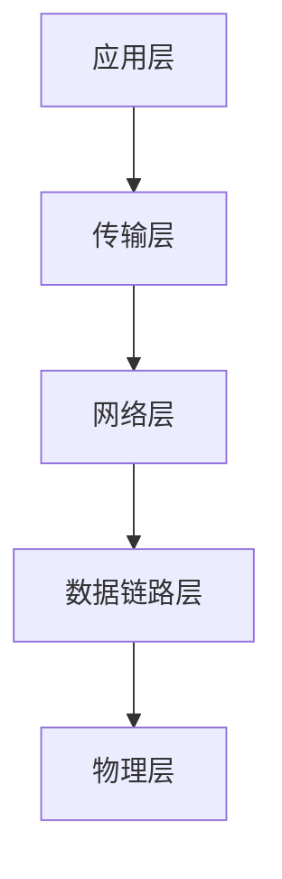
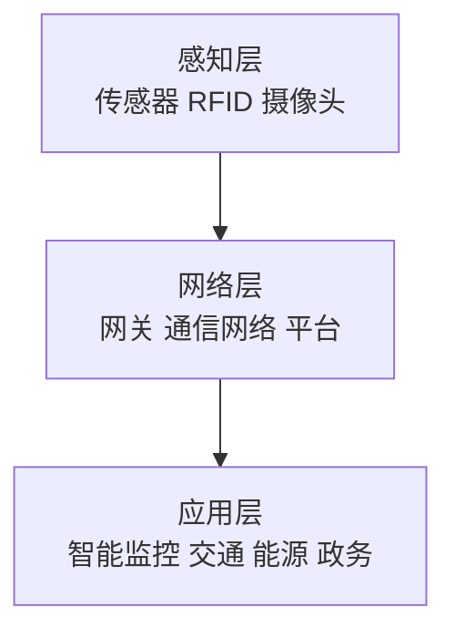

# 第 2 章 信息技术发展

> [!important] 本章定位
> 重点掌握“基础定义 + 作用 + 典型场景 + 易混概念”。不要把时间耗在过细的技术发展史上。

> [!abstract] 零基础解释
> 把计算机想成一个“会接收、处理、保存和传送信息的工具”。硬件是看得见的设备，软件是告诉设备怎么工作的指令，网络负责让设备互相通信，安全负责防止信息被乱看、乱改或无法使用。

> [!example] 项目例子
> 一个线上商城需要服务器运行程序，需要数据库保存订单，需要网络把用户和服务器连起来，还需要防火墙、身份认证和备份来保护交易数据。

## 1. 计算机软硬件

### 硬件

> [!abstract] 白话解释
> 硬件是计算机能摸到的部分。CPU 像负责思考和计算的大脑，内存像临时工作台，外存像长期文件柜，输入输出设备负责和外部世界交互。

- CPU：执行指令和进行运算。
- 内存：为运行中的程序提供高速临时存储，断电后通常丢失。
- 外存：长期保存程序和数据，如磁盘、固态存储。
- 输入/输出设备：实现人与系统或系统与外部环境的交互。
- 总线：在部件之间传输数据、地址和控制信号。

### 软件

> [!abstract] 白话解释
> 软件是一组告诉硬件“应该怎么做”的指令。系统软件搭好运行环境，应用软件解决具体业务，中间件则像“翻译和连接层”，帮助不同软件协作。

- 系统软件：操作系统、驱动、语言处理程序等，管理硬件并提供基础环境。
- 应用软件：面向具体业务和用户需求。
- 中间件：位于操作系统和应用之间，提供通信、事务、消息、服务治理等通用能力。

> [!warning] 易错
> 中间件不是操作系统，也不是最终业务应用；它的价值是屏蔽底层差异、支撑应用集成和运行。

## 2. 计算机网络

### 网络基本概念

> [!abstract] 白话解释
> 网络就是让不同设备能够互相找到、互相传递数据的连接系统。带宽像道路宽度，时延像消息在路上花的时间，协议则是双方约定的通信规则。

- 局域网 LAN：范围较小，常用于园区、机房和办公区域。
- 城域网 MAN：覆盖城市或较大区域。
- 广域网 WAN：跨城市、跨地区或跨国家连接。
- 拓扑：总线型、星型、环型、树型、网状型；星型易管理，网状型可靠性高但成本高。

### 分层思想

> [!abstract] 白话解释
> 分层是把复杂通信拆成几层，每层只负责一类事情，并通过约定的接口合作。这样修改一层时，不必把整个网络全部重写。

分层将复杂通信拆成相对独立的功能层，通过接口和协议协作。常见模型是 OSI 七层和 TCP/IP 分层模型。

常见协议和作用：

| 协议/技术 | 作用 |
| --- | --- |
| IP | 寻址和分组转发 |
| TCP | 面向连接、可靠传输、流量和拥塞控制 |
| UDP | 无连接、开销小、实时性较好但不保证可靠 |
| HTTP/HTTPS | Web 应用通信；HTTPS 增加加密保护 |
| DNS | 域名解析为 IP 地址 |
| DHCP | 自动分配网络配置 |
| FTP/SFTP | 文件传输；SFTP 具有加密保护 |
| SMTP/POP3/IMAP | 邮件发送、接收和管理 |

### 网络设备

- 集线器：广播转发，隔离能力弱。
- 交换机：按 MAC 地址转发，常用于局域网。
- 路由器：按 IP 地址连接不同网络并选择路径。
- 防火墙：按安全策略控制网络流量。
- 网关：连接协议或体系不同的网络。
- 负载均衡：把请求分配到多个服务实例，提高可用性和吞吐量。

## 3. 存储与数据库

### 存储

> [!abstract] 白话解释
> 存储解决的是“数据放在哪里、保存多久、读写多快、坏了能不能恢复”。内存快但临时，磁盘慢一些但能长期保存，RAID 主要解决设备故障下的可用性和性能问题。

- DAS：直接连接存储，结构简单，扩展和共享能力有限。
- NAS：通过文件协议提供共享文件存储。
- SAN：提供块级存储，适合高性能、集中式场景。
- 对象存储：以对象形式保存数据，适合海量非结构化数据。

RAID 通过数据分条、镜像或校验提高性能和可靠性，但 RAID 不是备份，不能替代异地备份。

### 数据库

> [!abstract] 白话解释
> 数据库是专门管理结构化数据的软件系统，不只是一个文件夹。它负责保存数据、按条件查询、控制多人同时修改，并尽量保证数据不矛盾。

关系数据库以表、行、列组织数据，常用 SQL 操作；核心特性可用 ACID 理解：

- 原子性：事务要么全部成功，要么全部失败。
- 一致性：事务前后数据满足约束。
- 隔离性：并发事务互不干扰到不一致状态。
- 持久性：提交后的结果不会因一般故障丢失。

非关系数据库常见类型：键值、文档、列族、图数据库。选择时看数据结构、扩展性、一致性、查询模式和吞吐需求。

## 4. 信息安全基础

信息安全目标：

- 保密性：防止未授权查看。
- 完整性：防止未授权修改或破坏。
- 可用性：授权用户需要时可以使用。

还包括真实性、可追溯性、不可否认性和隐私保护等要求。安全技术详见 [[01-精华知识点/08-信息安全工程]]。

### 信息系统安全的四个层次

> [!abstract] 白话解释
> 信息安全不能只看网络边界，还要分别保护设备、数据、内容和人的行为。设备坏了、数据泄露、内容违法或人员误操作，都可能造成安全问题。

针对信息系统，安全可以从四个层次理解：

| 层次 | 重点 |
| --- | --- |
| 设备安全 | 稳定性、可靠性、可用性，保证设备正常运行 |
| 数据安全 | 数据的保密性、完整性和可用性 |
| 内容安全 | 内容符合法律法规和组织政策 |
| 行为安全 | 行为过程的保密、完整和可控，程序执行不能破坏系统安全 |

## 5. 新一代信息技术

### 物联网

> [!abstract] 白话解释
> 物联网就是让现实世界的物体“能感知、能联网、能被管理”。传感器负责看见和采集，网络负责传送，应用负责把数据变成控制或服务。

物联网架构分为感知层、网络层和应用层。典型组成：传感器、RFID、网关、通信网络、平台和业务应用；其中平台能力属于网络层提供的支撑能力，不单独作为一层记忆。

### 云计算

> [!abstract] 白话解释
> 云计算不是一朵看不见的云，而是把服务器、存储和软件集中建设，再通过网络按需提供给用户。用户不必自己买齐所有设备，而是像按需用水用电一样使用计算资源。

按服务模式分为：

| 模式 | 用户主要使用 |
| --- | --- |
| IaaS | 虚拟机、存储、网络等基础资源 |
| PaaS | 运行环境、数据库、中间件和开发平台 |
| SaaS | 可直接使用的业务软件 |

按部署方式可分公有云、私有云、社区云和混合云。弹性、资源池化、按需自助、广泛网络访问和可计量是常见特征。

云计算的关键技术包括：

- 虚拟化：把物理计算、存储或网络资源抽象成可灵活分配的虚拟资源；容器属于开销较小的操作系统级虚拟化。
- 云存储：通常依赖分布式文件系统和集群管理实现弹性扩展。
- 多租户与访问控制：多个租户共享基础设施，但数据、权限和资源必须隔离；可结合基于属性的加密等机制。
- 云安全：同时保护云平台本身，以及利用云服务为用户提供病毒防护、检测等安全能力。

### 大数据

> [!abstract] 白话解释
> 大数据的重点不只是“数据很多”，而是数据规模、产生速度、格式种类和价值都超出传统方法的处理能力，需要新的存储、计算和分析方式。

常用 5V：规模（Volume）、速度（Velocity）、多样性（Variety）、价值（Value）、真实性（Veracity）。典型流程是采集、存储、计算、分析、可视化和应用。

### 区块链

> [!abstract] 白话解释
> 区块链可以理解为多方共同维护的一本“难以偷偷改写的账本”。数据按区块连接并由多个节点保存，适合需要共同确认和追溯的场景，但不等于所有数据都绝对真实。

通过分布式账本、共识、密码学和智能合约等实现多方协作记录。重点理解其适合多方互不完全信任、需要可追溯的场景；不等于“数据绝对不可修改”，链上错误数据仍需治理。

### 人工智能

> [!abstract] 白话解释
> 人工智能是让计算机通过规则、数据和模型完成识别、预测、推荐或决策等任务。它的结果依赖训练数据和模型质量，不是自动产生正确答案。

通过算法和数据实现感知、理解、推理、学习或生成。机器学习包括监督学习、无监督学习和强化学习；考试重在识别应用场景、数据质量和伦理安全风险。

### 虚拟现实与数字孪生

> [!abstract] 白话解释
> 虚拟现实是让人进入或感受到一个计算机生成的虚拟环境；数字孪生则是给现实中的设备或业务建立一个数字“映射”，用实时数据观察、分析和预测现实对象。

VR/AR/MR强调虚实交互体验；数字孪生强调对物理对象或过程建立动态数字映射，并利用实时数据分析、仿真和预测。

### Web 安全防护

> [!abstract] 白话解释
> Web 安全保护的是通过浏览器访问的应用。除了挡住网络流量，还要控制用户能做什么、防止网页被篡改、过滤危险内容，并保护登录和会话。

Web 常见威胁包括站点漏洞、浏览器及插件漏洞、网络钓鱼、僵尸网络、木马和键盘记录程序。常见防护技术：

- Web 访问控制：通过 IP、域名、用户名密码、PKI 等控制访问。
- 单点登录（SSO）：统一身份认证，实现“一点登录、多点访问”。
- 网页防篡改：通过轮询、完整性检查、事件触发或文件监测发现并恢复非法修改。
- Web 内容安全：邮件过滤、网页过滤和反间谍软件。

## 本章背诵清单

- [ ] IaaS 提供基础设施；PaaS 提供开发运行平台；SaaS 直接提供应用软件。
- [ ] TCP 可靠、有连接；UDP 无连接、开销小。交换机按局域网转发；路由器按网络之间转发。
- [ ] 防火墙按规则控制流量；IDS 检测并告警；IPS 检测后主动阻断。
- [ ] RAID 提升可用性或读写性能，不能代替备份。
- [ ] CIA：机密性、完整性、可用性；大数据 5V：大量、高速、多样、价值、真实性。
- [ ] 物联网三层：感知层、网络层、应用层；应用层是物联网发展的目标。
- [ ] 信息安全四层：设备安全、数据安全、内容安全、行为安全。
- [ ] 云计算关键技术：虚拟化、云存储、多租户与访问控制、云安全。
- [ ] Web 防护：访问控制、SSO、网页防篡改、内容过滤。
