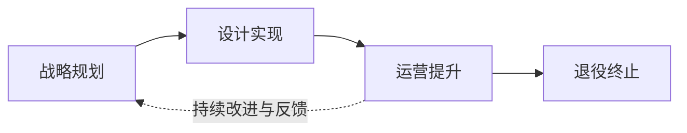
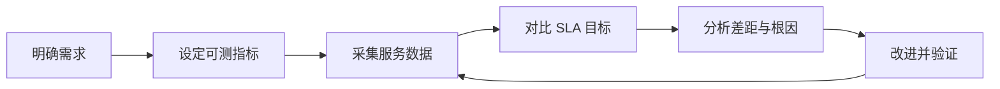

# 第 3 章 信息技术服务

> [!important] 本章定位
> 重点掌握 IT 服务的组成、生命周期和质量评价。案例常从“服务水平下降、投诉增加、运维无流程”切入。

## 1. IT 服务的内涵

服务是供方与需方之间通过提供价值满足需求的活动或结果。IT 服务以信息技术为主要手段，为客户的业务运行、管理和决策提供支持。

服务的典型特征：

- 无形性：不能像实物一样直接触摸和储存。
- 不可分离性：生产与消费常同时发生。
- 易逝性：服务能力不能长期库存。
- 异质性：不同人员、时间和环境可能造成体验差异。
- 互动性：服务质量取决于供需双方协作。

IT 服务的外延包括咨询、设计、开发、集成、运维、运营、数据服务、云服务和安全服务等。

## 2. IT 服务的组成

可用“人、技术、资源、过程”四要素记忆：

| 要素 | 关注点 |
| --- | --- |
| 人员 | 能力、角色、职责、培训和服务意识 |
| 技术 | 工具、平台、架构、自动化和监控 |
| 资源 | 设施、设备、数据、资金和供应商 |
| 过程 | 服务设计、交付、运营、改进和控制 |

ITSS 的基本原理可以用两个缩写记忆：

- PPTR：人员（People）、过程（Process）、技术（Technology）、资源（Resource），表示 IT 服务的四要素。
- SDOR：战略规划（Strategy & Planning）、设计实现（Design & Implementation）、运营提升（Operation & Promotion）、退役终止（Retirement & Termination），表示 IT 服务生命周期的四阶段。

服务提供必须以客户需求和业务价值为导向，同时满足安全、合规、可用性和成本约束。

## 3. IT 服务生命周期

### 3.1 战略规划

明确客户需求、业务目标、服务范围、价值、成本和能力，确定服务组合及服务级别目标。

### 3.2 设计实现

把服务目标转化为可交付的服务方案，设计架构、流程、人员、技术、资源、SLA、风险和安全要求，并完成建设或上线准备。

### 3.3 运营提升

按服务级别协议持续提供服务，处理事件、问题、请求和变更，监控指标、报告绩效并持续改进。

### 3.4 退役终止

在服务终止、替换或迁移时，完成通知、数据迁移、资产处置、合同关闭、知识转移和风险控制，保证业务连续。

> [!warning] 易错
> 退役不是“关掉系统”这么简单，还要处理数据、合同、用户通知、替代服务和合规留存。

## 4. 服务标准化

标准化的目标是减少随意性，使服务可复制、可度量、可比较和可持续改进。常见工作：

- 建立服务目录和服务级别协议（SLA）。
- 定义事件、问题、变更、配置、发布和请求流程。
- 明确指标口径、采集方式、报告周期和责任人。
- 建立知识库、服务台、监控和持续改进机制。

### IT 服务产业化三阶段

IT 服务产业化通常经历以下过程：

1. 产品服务化：产品不再只交付软件或硬件本身，而是围绕产品持续提供服务。
2. 服务标准化：统一服务范围、内容、过程、交付界面、指标和制度，使服务能够规模化复制。
3. 服务产品化：形成清晰的服务目录、明确的功能和性能指标，使服务具有独立价值并可组合交付。

## 5. 服务质量评价

质量评价应同时看供方能力、服务过程、交付结果和客户体验。

常见指标：可用性、响应时间、解决时间、一次解决率、故障率、满意度、履约率、成本和安全事件数量。

IT 服务质量模型可从五类特性理解：

- 安全性：服务过程中的信息和资源受到保护。
- 可靠性：服务能够稳定、连续地达到约定要求。
- 响应性：能够及时响应和解决服务请求。
- 有形性：服务过程、交付物和记录可以被看见、验证和追溯。
- 友好性：供方具有主动性、专业性、灵活性、合规性和礼貌性。

评价流程：

1. 明确客户和其他相关方的期望。
2. 将期望转化为可测量的服务指标。
3. 采集数据并与 SLA/目标比较。
4. 分析差距和根因。
5. 制定改进措施，跟踪验证效果。

## 6. 服务运营中的常见概念

- 事件：已经发生、导致服务中断或质量下降的事件，目标是尽快恢复服务。
- 问题：一个或多个事件背后的根本原因，目标是消除原因并防止复发。
- 服务请求：用户提出的信息、访问、咨询或标准服务需求。
- 变更：对服务、配置项或环境的受控修改。
- 配置项：需要受控管理的服务组件、设备、软件、文档或关系。

> [!important] 记忆
> 事件先恢复，问题再根因；紧急变更也要记录、评估、授权和复盘。

## 本章背诵清单

- [ ] IT 服务四要素：人员、技术、资源、过程。
- [ ] 生命周期四阶段：战略规划→设计实现→运营提升→退役终止（SDOR）。
- [ ] IT 服务四要素记作 PPTR：人员、过程、技术、资源。
- [ ] 服务产业化三阶段：产品服务化→服务标准化→服务产品化。
- [ ] 服务质量五类特性：安全性、可靠性、响应性、有形性、友好性。
- [ ] 事件=尽快恢复服务；问题=查找根因；服务请求=用户提出的标准服务需求；变更=受控修改。
- [ ] SLA 指标必须可测量、可报告、可追踪，并明确服务目标。
