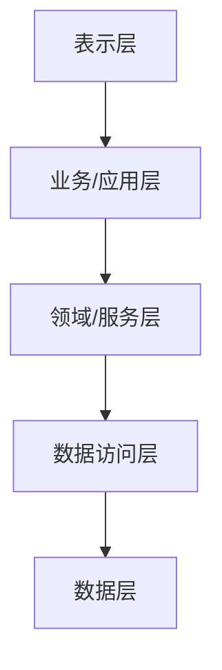
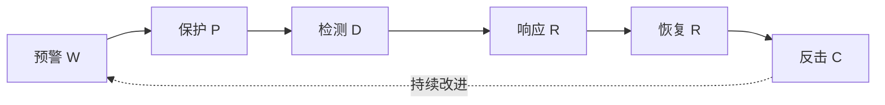

# 第 4 章 信息系统架构

> [!important] 本章定位
> 架构题考“层次、职责、约束和权衡”。看到“高并发、易扩展、数据共享、安全隔离、弹性部署”，要能选出合适的架构思路。

> [!abstract] 零基础解释
> 架构就是系统的“整体蓝图”：哪些部分负责什么、它们怎样连接、数据怎样流动，以及系统如何应对性能、安全和扩展要求。架构不是越复杂越好，而是在目标、成本和风险之间做取舍。

> [!example] 项目例子
> 建设电商系统时，用户页面、订单业务和数据库可以分层；访问量增加时，可以增加应用服务器；支付模块还要单独隔离和加强权限，这些整体安排就是架构设计。

## 1. 架构基础

信息系统架构是对系统组成、结构、关系、原则和演进方式的高层设计。架构决策要同时考虑业务目标、质量属性、技术约束、成本、风险和组织能力。

基本原则：

- 以业务和用户价值为导向。
- 统一规划、分步实施，避免重复建设。
- 标准化、开放性和可扩展性。
- 安全与发展并重，适度超前。
- 统筹数据、应用、技术、网络和安全。

## 2. 系统架构与常用模型

### 架构分类

- 单体架构：部署简单、开发成本低；规模增长后耦合和扩展困难。
- 分层架构：把表现、业务、数据等职责分离，便于维护。
- 客户端/服务器：客户端负责交互，服务器提供集中服务。
- 浏览器/服务器：通过浏览器访问，部署和维护相对集中。
- SOA：以服务为基本单元，通过标准契约和消息实现业务能力复用。
- 微服务：将业务拆成可独立开发、部署和扩展的服务；需承担分布式事务、治理、监控和运维复杂度。

从考题常用的抽象角度，还要区分：

- 物理架构：关注硬件、设备和资源在空间上的分布；集中式资源集中、便于管理，但存在扩展和单点故障问题；分布式资源分散，可提高容错和扩展能力，但协调和管理更复杂。
- 逻辑架构：关注功能子系统、业务模块及其关系，不直接等同于设备的物理位置。

SOA 在 Web 应用之间的典型实现是 WebService。常见相关协议或描述语言包括 SOAP 和 WSDL。

### 质量属性

常见质量属性包括性能、可用性、可靠性、安全性、可维护性、可扩展性、互操作性和可移植性。架构设计本质上是在质量属性之间做权衡。

> [!warning] 易错
> “微服务一定更好”是错误判断。系统规模、团队能力、运维能力和业务边界不匹配时，微服务会增加复杂度。

## 3. 应用架构

应用架构关注业务功能如何组织、服务如何协作和应用如何演进。

常见分层：

设计重点：高内聚低耦合、接口契约、复用、可测试、可观测、权限控制和异常处理。分层不是越多越好，每一层都应有清晰职责。

## 4. 数据架构

数据架构关注数据从产生、采集、存储、共享、使用到归档和销毁的全生命周期。

重点原则：

- 统一数据标准和编码。
- 数据与应用适度解耦，减少重复采集。
- 明确数据权属、责任、质量和安全等级。
- 建立主数据、元数据、数据目录和血缘关系。
- 让数据可共享、可追溯、可审计。

常见数据架构：操作型数据库支撑交易；数据仓库支持主题分析；数据湖/湖仓适合多源异构和大规模数据；数据服务通过接口或共享平台对外提供能力。

## 5. 技术架构

技术架构是支撑应用运行的基础技术组合，包括操作系统、数据库、中间件、容器、计算、存储、网络和监控等。

选型要比较：功能、性能、可靠性、安全性、兼容性、成熟度、生态、成本、运维能力和供应风险。

## 6. 网络架构

### 局域网和广域网

局域网关注交换、VLAN、冗余和访问控制；广域网关注路由、链路质量、带宽、容灾和跨区域连接。网络设计要考虑分区、冗余、扩展和安全边界。

### 5G 与边缘计算

5G 常见能力包括高带宽、低时延和大连接；边缘计算把部分计算和数据处理下沉到接近数据源的位置，以减少时延和回传压力。

### 软件定义网络（SDN）

SDN 将控制平面和转发平面解耦，通过集中控制器以软件方式管理网络，便于编程、自动化和统一策略，但要关注控制器高可用和安全。

网络架构题常比较以下结构：

| 架构 | 主要特点 |
| --- | --- |
| 单核心 | 结构简单、成本较低，但核心设备存在单点故障风险 |
| 双核心 | 通过冗余和热切换提高连续性，但成本和设计复杂度更高 |
| 环形 | 链路具有冗余，适合较大范围互联，但要防止环路 |
| 半冗余广域网 | 多台核心路由设备互联，扩展灵活，成本和管理复杂度较高 |

选择架构时要结合可靠性、扩展性、成本、链路冗余和故障影响范围，而不能只看设备数量。

## 7. 安全架构

安全架构采用纵深防御：身份、访问控制、网络边界、主机、应用、数据、审计、备份和应急等多层保护。

安全设计要覆盖：

- 机密性、完整性、可用性。
- 身份鉴别、授权、最小权限和职责分离。
- 网络分区、隔离、防火墙、入侵检测与防护。
- 数据加密、脱敏、备份、恢复和审计。
- 安全开发、漏洞管理、监测预警和应急响应。

### WPDRRC 安全保障模型

WPDRRC 用六个环节描述信息系统安全保障：

- 预警：发现薄弱环节和风险趋势。
- 保护：通过加密、认证、访问控制、防火墙等降低风险。
- 检测：发现威胁、漏洞和异常行为。
- 响应：报警、隔离、封堵、报告和处置安全事件。
- 恢复：通过容错、冗余、备份和修复恢复正常运行。
- 反击：开展取证、追踪和依法打击。

三大要素是人员、策略和技术：人员是核心，策略是桥梁，技术是保证。

### OSI 安全服务与数据库完整性

OSI 安全架构常考五类安全服务：

1. 鉴别：确认通信实体或数据来源的真实性。
2. 访问控制：限制未授权主体使用资源。
3. 数据机密性：防止数据被未授权获取或披露。
4. 数据完整性：防止数据被未授权修改、删除或破坏。
5. 抗抵赖性：防止通信参与者否认已经发生的行为。

关系数据库完整性约束主要包括实体完整性、参照完整性和用户定义的完整性。静态约束适合放入数据库模式或 DBMS 约束中，动态业务规则可由应用程序实现；设计时还要权衡完整性控制对性能的影响。

## 8. 云原生架构

云原生强调充分利用云的弹性、自动化和服务化能力。常见特征：容器化、微服务、DevOps、持续交付、自动伸缩、服务治理、可观测性和基础设施即代码。

常见模式：

- 服务网格：把服务通信、治理和安全能力下沉到基础设施层。
- 无服务器：按事件或请求运行函数/服务，减少服务器管理，但要注意厂商绑定和运行限制。
- 容器编排：统一调度、扩缩容、服务发现、滚动发布和故障恢复。

> [!important] 案例答题
> 写云原生不要只写“上云”。要写容器化、服务拆分、自动化交付、弹性伸缩、监控告警、故障恢复和安全治理。

## 本章背诵清单

- [ ] 分层强调职责分离；SOA强调可复用服务；微服务强调独立部署，但会增加分布式复杂度。
- [ ] 应用架构管功能与服务；数据架构管数据组织；技术架构管平台与中间件；网络架构管连接与通信。
- [ ] 纵深防御=多层防护；最小权限=只授予完成任务所需的最小权限。
- [ ] 云原生重点：容器化、服务化、自动化交付、弹性伸缩、可观测性和故障恢复。
- [ ] 物理架构关注设备分布；逻辑架构关注功能和模块关系；SOA 的 Web 典型实现是 WebService。
- [ ] WPDRRC：预警、保护、检测、响应、恢复、反击；三大要素是人员、策略、技术。
- [ ] OSI 五类安全服务：鉴别、访问控制、数据机密性、数据完整性、抗抵赖性。
- [ ] 数据库完整性：实体完整性、参照完整性、用户定义完整性。
