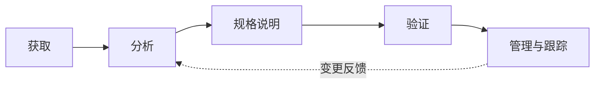
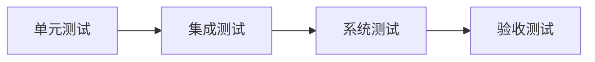

# 第 5 章 软件工程

> [!important] 本章定位
> 重点是需求、设计、测试、配置和交付的完整链路。案例中看到“需求不清、直接编码、未评审、未测试、版本混乱”，都要从软件工程角度回答。

## 1. 软件工程与生命周期

软件工程用系统化、规范化、可度量的方法开发、运行、维护和演进软件。生命周期模型要根据需求稳定性、风险、交付节奏和客户参与程度选择。

| 模型 | 适用特点 | 风险/限制 |
| --- | --- | --- |
| 瀑布 | 需求较稳定、阶段清晰 | 变更成本高、反馈晚 |
| 迭代/增量 | 分批交付、持续反馈 | 需要合理切分和集成 |
| 原型 | 需求不清、需要快速确认 | 原型可能被误当成正式产品 |
| 螺旋 | 高风险、需要持续分析 | 管理和成本较复杂 |
| 敏捷 | 变化快、客户持续参与 | 需要高协作和自组织能力 |

## 2. 软件需求

### 需求层次

- 业务需求：组织为什么做、要达到什么目标。
- 用户需求：用户需要完成什么任务。
- 系统需求：系统应提供什么功能和质量属性。
- 功能需求：系统“做什么”。
- 非功能需求：性能、安全、可用性、可靠性、易用性、兼容性等“做到什么程度”。

### QFD 质量功能展开

QFD（Quality Function Deployment）用于把用户要求转化为软件需求，目标是提高用户满意度。用户需求常分为：

- 常规需求：用户明确认为系统应该具备的功能或性能，实现越充分，满意度通常越高。
- 期望需求：用户认为系统理应具备，但不一定能清楚表达；没有实现时容易产生不满意。
- 意外需求：超出用户明确要求、能带来额外惊喜的功能或性能，也称兴奋需求。

### 需求工程流程

获取方法：访谈、问卷、观察、研讨会、原型、文档分析和场景分析。

需求规格说明书应清晰、完整、一致、可验证、可修改、可追踪。需求跟踪矩阵把需求连接到设计、代码、测试和验收。

> [!warning] 易错
> “客户说了”不等于需求已确认；需求需要记录、澄清、评审、基线化并可追踪。

### 需求变更

需求变更要记录来源和原因，分析对范围、进度、成本、质量、资源、风险和合同的影响，经过授权后再实施。

## 3. 软件设计

### 结构化设计

以数据流、数据结构和功能分解为基础，强调模块化、低耦合、高内聚。常见图包括数据流图、数据字典、结构图和模块接口说明。

### 结构化分析

结构化分析以数据字典为核心，围绕三个模型描述系统：

| 模型 | 常用表示 | 关注点 |
| --- | --- | --- |
| 数据模型 | E-R 图 | 实体、属性和关系 |
| 功能模型 | 数据流图（DFD） | 数据流动、处理和外部实体 |
| 行为模型 | 状态转换图（STD） | 状态、事件和状态转换 |

数据字典要说明数据项、数据结构、数据流、数据存储和处理过程，是保证分析人员与用户理解一致的重要工具。

### 面向对象设计

以对象、类、属性、操作和关系组织系统，基本特征是封装、继承、多态和抽象。设计时关注职责分配、接口、依赖、复用和可扩展性。

### UML 常用图

| 图 | 主要表达 |
| --- | --- |
| 用例图 | 参与者与系统功能目标 |
| 类图 | 类、属性、操作及静态关系 |
| 对象图 | 某一时刻对象实例及关系 |
| 顺序图 | 按时间顺序的对象消息 |
| 活动图 | 流程、分支、并发和活动 |
| 状态图 | 对象状态及事件转换 |
| 组件图 | 软件组件及依赖 |
| 部署图 | 节点、设备和软件部署关系 |

### 设计模式

模式是对常见设计问题的可复用解决方案。考试重点是“场景—目的”，如工厂模式用于创建对象、观察者模式用于一对多通知、适配器模式用于接口兼容、单例模式限制实例数量。

### UML 2.0 图与视图

UML 2.0 常见的 14 种图可按静态图和动态图记忆：

| 类别 | 图 |
| --- | --- |
| 静态图 | 类图、对象图、构件图、组合结构图、用例图、部署图、制品图、包图 |
| 动态图 | 顺序图、通信图、定时图、状态图、活动图、交互概览图 |

UML 五种视图：

- 用例视图：描述系统应提供的功能，是需求分析的基础。
- 逻辑视图：描述类、对象、子系统和用例实现。
- 进程视图：描述进程、线程、并发和同步。
- 实现视图：描述代码文件、组件及其组织结构。
- 部署视图：描述软件构件到物理节点的映射。

## 4. 软件实现

- 编码前应有明确的需求、设计、接口和编码规范。
- 代码应进行评审、静态检查、单元测试和版本控制。
- 构建和发布应可重复、可追踪、可回退。

### 测试层次

- 单元测试：验证最小可测试单元。
- 集成测试：验证模块/接口组合。
- 系统测试：验证完整系统及非功能要求。
- 验收测试：由客户或授权相关方依据验收标准确认。

常见测试：功能、性能、安全、兼容性、可用性、回归、压力、负载和恢复测试。

## 5. 配置管理

配置管理通过识别、版本、基线、变更控制和审计，使软件产品及其文档保持一致、可追溯和可复现。详见 [[01-精华知识点/15-组织保障]]。

## 6. 部署、交付与持续交付

- 部署：把软件安装、配置到目标环境。
- 交付：将产品、文档、培训和服务正式交给客户。
- 持续交付：代码经过自动化构建和测试后，始终处于可发布状态。
- 持续部署：通过自动化流程将通过验证的变更自动发布到生产环境。

发布要有环境隔离、审批、监控、备份和回退方案。蓝绿发布、滚动发布、金丝雀发布用于降低发布风险，但必须结合业务容忍度。

## 7. 软件质量与过程能力

软件质量不仅是“没有缺陷”，还包括功能适合性、性能效率、兼容性、易用性、可靠性、安全性、可维护性和可移植性等。

CMMI/过程能力成熟度的核心思想是：把个人经验转化为组织过程，进行定义、度量、控制和持续改进。不要把成熟度理解成“等级越高越适合所有组织”，应结合成本和业务目标。

## 本章背诵清单

- [ ] 需求工程流程：获取与分析→规格说明→验证→变更管理。
- [ ] 功能需求说明“做什么”；非功能需求说明性能、安全、可靠性等“做到什么程度”。
- [ ] 用例图看参与者和功能；类图看静态结构；时序图看对象交互顺序；活动图看流程。
- [ ] QFD 把用户要求转化为软件需求；三类需求：常规、期望、意外。
- [ ] 结构化分析：数据字典为核心，E-R 图表示数据模型，DFD 表示功能模型，STD 表示行为模型。
- [ ] UML 14 种图分为 8 种静态图和 6 种动态图；五种视图：用例、逻辑、进程、实现、部署。
- [ ] 单元测试测模块；集成测试测模块之间；系统测试测完整系统；验收测试测是否满足用户和合同要求。
- [ ] 持续交付=随时可发布；持续部署=通过自动化验证后自动发布到生产环境。
