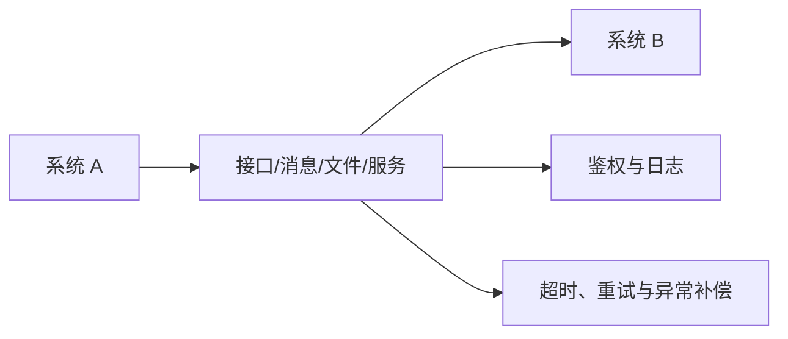

# 第 7 章 软硬件系统集成

> [!important] 本章定位
> 系统集成题关注“把不同设备、软件、网络和业务整合为可运行、可验收的整体”，常与范围、接口、测试、安全和验收结合出题。

> [!abstract] 零基础解释
> 系统集成就是把原本分散、来自不同厂商的设备和软件接起来，让它们按照同一个业务目标协同工作。难点不只是安装，还包括接口、版本、环境、测试和最终验收。

> [!example] 项目例子
> 智慧停车项目要把摄像头、门禁、收费系统、网络和管理平台接通。任何一个接口格式不一致，车辆识别、计费或报表都可能出错，因此必须联调和验收。

## 1. 系统集成基础

> [!abstract] 白话解释
> 系统集成不是把设备买回来接上线，而是让不同厂商、不同技术的部分在同一个业务流程里可靠配合。最终判断标准是：整体业务能不能运行、数据对不对、出了问题能不能定位和恢复。

系统集成是根据总体目标和需求，对产品、技术、设备、软件、网络、数据、业务和服务进行综合设计、采购、实施、联调和交付。

集成工作的核心：

- 明确需求、边界、接口和验收标准。
- 设计总体架构和集成方案。
- 管理供应商、设备、版本、环境和依赖。
- 进行安装、配置、开发、接口联调和测试。
- 完成培训、文档、移交、运维和验收。

## 2. 基础设施集成

> [!abstract] 白话解释
> 基础设施集成是在搭“系统能运行的地基”，包括机房、网络、供配电、布线、服务器、存储和安全设备。地基不稳定，上层软件再好也无法持续服务。

### 弱电工程

> [!abstract] 白话解释
> 弱电工程主要传输信息和控制信号，例如网络、监控、门禁和消防。它看起来是施工问题，但项目管理还要关注材料、隐蔽工程记录、测试和竣工资料。

包括综合布线、机房、监控、门禁、消防、会议、安防和楼宇控制等。实施时关注需求确认、设计、材料检验、隐蔽工程记录、施工质量、测试和竣工验收。

### 网络集成

> [!abstract] 白话解释
> 网络集成就是规划“哪些设备通过什么路径通信”。地址、路由、交换、VLAN 和安全策略共同决定设备能不能互通、谁能访问谁，以及网络出故障时是否还有备用路径。

主要工作：地址规划、设备选型、拓扑设计、路由交换、VLAN、无线、网络安全、链路冗余、监控和性能测试。

网络集成验收至少关注：连通性、带宽、时延、丢包、可靠性、安全策略、设备配置备份和运维文档。

### 数据中心集成

> [!abstract] 白话解释
> 数据中心是集中承载服务器、存储和网络的运行环境。除了设备本身，还要保证电力、制冷、消防、监控、备份、容灾和维护条件，否则设备可能因为环境问题停机。

关注机房基础环境、供配电、制冷、机柜、综合布线、服务器、存储、网络、安全、监控、备份和容灾。数据中心不是“设备堆在一起”，要保证容量、可靠性、安全性、可维护性和扩展性。

## 3. 软件集成

> [!abstract] 白话解释
> 软件集成解决的是“不同软件如何交换信息并共同完成业务”。接口能调用只是开始，还要约定数据格式、身份权限、超时重试、重复请求和失败后的补偿方式。

### 基础软件集成

> [!abstract] 白话解释
> 基础软件是应用运行所依赖的底座，例如操作系统、数据库和中间件。集成时要确认版本兼容、配置正确、性能满足要求，并且后续有人维护和升级。

对操作系统、数据库、中间件、虚拟化、容器、备份和监控等进行安装、配置、兼容性验证和性能调优。

### 应用软件集成

> [!abstract] 白话解释
> 应用软件集成像让两个部门的系统“对话”。接口契约规定双方传什么、怎么验证、出错怎么办；幂等则保证同一请求重复到达时，不会把一笔业务错误地执行多次。

通过接口、消息、共享数据库、文件交换或服务调用实现应用协同。要明确接口契约、数据格式、编码、鉴权、幂等、超时、重试、日志和异常处理。

### 其他软件集成

> [!abstract] 白话解释
> 工具、运维、身份和安全平台虽然不是业务功能，但会影响开发、登录、监控和审计。它们集成不好，可能出现“业务能用但没人监控”“人员离职后权限还在”等问题。

包括工具平台、开发平台、运维平台、身份平台和安全平台等。集成时注意版本兼容、许可、升级、配置管理和厂商支持。

> [!warning] 易错
> “接口能调用”不等于集成完成，还要验证数据一致性、异常处理、安全、性能、可监控性和业务结果。

## 4. 业务应用集成

> [!abstract] 白话解释
> 业务应用集成关注的不是某个接口是否成功，而是一件完整业务能否跨系统走通。例如从下单、支付到发货，每一步的数据、责任部门和异常处理都要衔接起来。

业务应用集成关注跨部门、跨系统的端到端业务流程。步骤可概括为：

1. 梳理业务流程和参与部门。
2. 明确数据主责、共享范围和接口边界。
3. 设计集成架构、流程编排和异常补偿。
4. 完成接口开发、联调、测试和试运行。
5. 组织用户培训、验收和运维移交。

## 5. 系统集成实施检查点

> [!abstract] 白话解释
> 检查点就是在关键阶段停下来确认“能不能继续”。实施前确认条件齐不齐，实施中确认过程受控，实施后确认成果可用、资料完整、客户能接手。

### 实施前

- 需求、范围和总体方案已确认。
- 设备、软件、环境和人员已准备。
- 施工/实施计划、风险和安全措施已批准。
- 变更、配置、测试和验收标准已明确。

### 实施中

- 记录安装配置和版本。
- 及时处理接口、资源、质量和进度问题。
- 按计划进行单项测试、集成测试和安全测试。
- 重要变更先评估和审批。

### 实施后

- 完成试运行、缺陷关闭和用户确认。
- 提交竣工文档、配置清单、测试报告和培训记录。
- 完成验收、移交、运维交接、备份和回退资料。

## 本章背诵清单

- [ ] 系统集成流程：需求→设计→采购→实施→测试→验收→移交。
- [ ] 网络检查连通性和安全性；数据中心检查设备、环境和容灾；软件检查功能、接口、性能和部署。
- [ ] 接口集成要验证连通性、数据格式、数据准确性、安全、性能、异常处理和重试机制。
