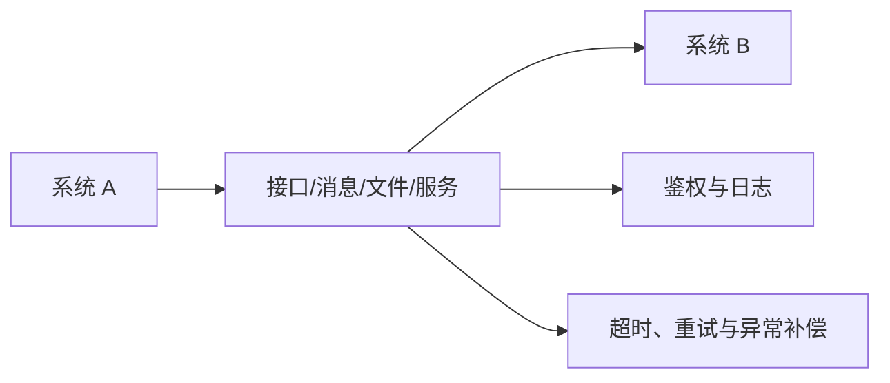

# 第 7 章 软硬件系统集成

> [!important] 本章定位
> 系统集成题关注“把不同设备、软件、网络和业务整合为可运行、可验收的整体”，常与范围、接口、测试、安全和验收结合出题。

## 1. 系统集成基础

系统集成是根据总体目标和需求，对产品、技术、设备、软件、网络、数据、业务和服务进行综合设计、采购、实施、联调和交付。

集成工作的核心：

- 明确需求、边界、接口和验收标准。
- 设计总体架构和集成方案。
- 管理供应商、设备、版本、环境和依赖。
- 进行安装、配置、开发、接口联调和测试。
- 完成培训、文档、移交、运维和验收。

## 2. 基础设施集成

### 弱电工程

包括综合布线、机房、监控、门禁、消防、会议、安防和楼宇控制等。实施时关注需求确认、设计、材料检验、隐蔽工程记录、施工质量、测试和竣工验收。

### 网络集成

主要工作：地址规划、设备选型、拓扑设计、路由交换、VLAN、无线、网络安全、链路冗余、监控和性能测试。

网络集成验收至少关注：连通性、带宽、时延、丢包、可靠性、安全策略、设备配置备份和运维文档。

### 数据中心集成

关注机房基础环境、供配电、制冷、机柜、综合布线、服务器、存储、网络、安全、监控、备份和容灾。数据中心不是“设备堆在一起”，要保证容量、可靠性、安全性、可维护性和扩展性。

## 3. 软件集成

### 基础软件集成

对操作系统、数据库、中间件、虚拟化、容器、备份和监控等进行安装、配置、兼容性验证和性能调优。

### 应用软件集成

通过接口、消息、共享数据库、文件交换或服务调用实现应用协同。要明确接口契约、数据格式、编码、鉴权、幂等、超时、重试、日志和异常处理。

### 其他软件集成

包括工具平台、开发平台、运维平台、身份平台和安全平台等。集成时注意版本兼容、许可、升级、配置管理和厂商支持。

> [!warning] 易错
> “接口能调用”不等于集成完成，还要验证数据一致性、异常处理、安全、性能、可监控性和业务结果。

## 4. 业务应用集成

业务应用集成关注跨部门、跨系统的端到端业务流程。步骤可概括为：

1. 梳理业务流程和参与部门。
2. 明确数据主责、共享范围和接口边界。
3. 设计集成架构、流程编排和异常补偿。
4. 完成接口开发、联调、测试和试运行。
5. 组织用户培训、验收和运维移交。

## 5. 系统集成实施检查点

### 实施前

- 需求、范围和总体方案已确认。
- 设备、软件、环境和人员已准备。
- 施工/实施计划、风险和安全措施已批准。
- 变更、配置、测试和验收标准已明确。

### 实施中

- 记录安装配置和版本。
- 及时处理接口、资源、质量和进度问题。
- 按计划进行单项测试、集成测试和安全测试。
- 重要变更先评估和审批。

### 实施后

- 完成试运行、缺陷关闭和用户确认。
- 提交竣工文档、配置清单、测试报告和培训记录。
- 完成验收、移交、运维交接、备份和回退资料。

## 本章背诵清单

- [ ] 系统集成流程：需求→设计→采购→实施→测试→验收→移交。
- [ ] 网络检查连通性和安全性；数据中心检查设备、环境和容灾；软件检查功能、接口、性能和部署。
- [ ] 接口集成要验证连通性、数据格式、数据准确性、安全、性能、异常处理和重试机制。
