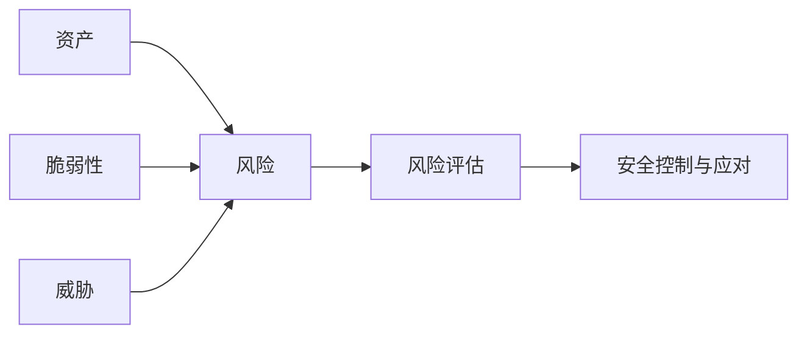
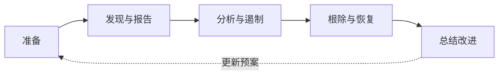

# 第 8 章 信息安全工程

> [!important] 本章定位
> 重点掌握安全目标、管理体系、等级保护、技术措施和工程流程。案例答题优先写“识别风险—分层防护—权限控制—监测审计—备份应急—持续改进”。

> [!abstract] 零基础解释
> 信息安全不是只装一个防火墙，而是保护信息和系统的三个基本目标：不该看的人看不到、不该改的内容改不了、需要使用时系统能正常工作。

> [!example] 项目例子
> 报修系统要限制普通用户查看别人的手机号，防止数据被篡改，并准备备份和应急方案应对服务器故障。权限、审计、备份和恢复要一起考虑。

## 1. 信息安全目标

> [!abstract] 白话解释
> 安全目标可以用三个问题理解：不该看的人能不能看到（保密性），不该改的内容能不能被改（完整性），需要使用时系统能不能正常工作（可用性）。

### CIA 三要素

> [!abstract] 白话解释
> CIA 不是三个孤立口号，而是安全设计的检查表。例如给文件加密主要保护保密性，签名和校验主要保护完整性，备份和冗余主要保障可用性。

- 保密性（Confidentiality）：只有授权主体可以访问。
- 完整性（Integrity）：数据和系统未经授权不能被篡改。
- 可用性（Availability）：需要时能够正常使用。

扩展目标包括真实性、不可否认性、可审计性、可追溯性和隐私保护。

## 2. 安全威胁与风险

> [!abstract] 白话解释
> 资产是要保护的东西，脆弱性是它存在的缺口，威胁是可能利用缺口造成伤害的因素，风险是这件事发生的可能性和影响。没有资产或影响，就不能只凭“有漏洞”判断风险大小。

威胁来源包括人员误操作、恶意内部人员、网络攻击、恶意软件、漏洞利用、设备故障、自然灾害和供应链风险。

```text
资产 + 脆弱性 + 威胁 → 安全风险
```



风险管理要识别资产、威胁、脆弱性、可能性和影响，确定风险等级并选择应对措施。

## 3. 信息安全管理

> [!abstract] 白话解释
> 信息安全管理是让安全要求真正落地的组织方法：谁负责、按什么制度做、怎样检查、出了问题怎么办。买设备只能提供工具，不能代替制度、人员和持续运营。

### 管理内容

> [!abstract] 白话解释
> 管理内容覆盖人、设备、网络、应用、数据、供应商和事件，不只盯着网络边界。因为一次泄露可能来自误操作、权限过大、开发缺陷或供应链，而不只是黑客攻击。

- 安全方针、组织、角色和责任。
- 资产识别、分类分级和风险评估。
- 人员安全、访问控制和权限审查。
- 物理、网络、主机、应用和数据安全。
- 供应商、开发、运维、备份和应急管理。
- 安全培训、监测、审计、事件响应和持续改进。

### 管理体系

> [!abstract] 白话解释
> 管理体系要形成闭环：制定要求，按要求执行，检查执行结果，发现问题后改进，再进入下一轮。这样安全能力才不会随着某个人离职或某台设备更换而消失。

安全管理体系应形成“制度—流程—技术—人员—监督”的闭环，定期评审目标、指标、风险和改进计划。安全不是一次性采购设备，而是持续运行的管理能力。

## 4. 网络安全等级保护

> [!abstract] 白话解释
> 等级保护是按系统受到破坏后的影响程度，确定应该投入多强的保护。它不是买一个“等级保护产品”，而是一套定级、备案、整改、测评、检查和持续改进的工作。

等级保护的基本思路是：对信息系统进行定级、备案、建设整改、等级测评和监督检查，并根据等级采取相应保护措施。

典型工作链：


答题时注意：先确定系统承载业务和受损影响，再确定等级；测评不是做完就结束，还要整改和持续运营。

## 5. 安全机制与安全服务

> [!abstract] 白话解释
> 安全机制是解决具体问题的办法：认证确认身份，授权分配权限，加密保护内容，审计留下记录，备份帮助恢复。实际系统通常要把多种机制组合起来。

### 常见安全机制

> [!abstract] 白话解释
> 可以把这些机制想成一栋楼的安全措施：门禁确认来的人是谁，权限决定能进哪些房间，摄像头记录做过什么，加密保护运送中的文件，备份保证东西损坏后还能找回。

- 加密：保护数据机密性或完整性。
- 数字签名：实现完整性、身份确认和不可否认性。
- 身份认证：确认“你是谁”。
- 授权：决定“你能做什么”。
- 访问控制：执行主体、客体和权限规则。
- 审计：记录和分析行为，支持追责与追溯。
- 备份与恢复：降低数据丢失和服务中断影响。
- 隔离、冗余、容错和应急：降低攻击和故障扩散。

### 常见安全设备/系统

> [!abstract] 白话解释
> 防火墙像门卫，IDS 像报警器，IPS 像会自动拦截的门卫，WAF 专门保护 Web 应用，堡垒机专门管控和记录运维人员。它们负责的层次不同，不能互相完全替代。

- 防火墙：依据策略控制网络流量。
- IDS：检测入侵并告警，通常偏被动。
- IPS：检测并主动阻断或防护。
- VPN：在公共网络上建立受保护的通信通道。
- 漏洞扫描：发现系统、应用和设备的已知弱点。
- 堡垒机：集中管理运维访问、授权和审计。
- WAF：针对 Web 应用层攻击提供防护。

> [!warning] 易错
> 防火墙、IDS、IPS 不是互相替代；安全需要多层组合，不能把某一种设备当成全部安全。

## 6. 密码与身份

> [!abstract] 白话解释
> 对称加密像双方共用一把钥匙，速度快但要安全交钥匙；非对称加密像公钥锁、私钥开，便于建立信任但速度较慢；哈希像给文件生成指纹，不能靠它还原原文。

- 对称加密：加解密使用同一密钥，速度快，密钥分发是难点。
- 非对称加密：公钥和私钥成对，便于密钥交换和签名，计算开销较大。
- 哈希：将输入映射为固定长度摘要，常用于完整性和口令保护；哈希不是可逆加密。
- PKI：以数字证书、证书机构和密钥体系支撑身份认证、加密和签名。

身份安全还要采用多因素认证、最小权限、职责分离、定期复核和离职及时回收权限。

## 7. 安全工程体系

> [!abstract] 白话解释
> 安全工程的关键是“从一开始就考虑安全”。如果需求和设计阶段没考虑权限、日志和备份，等系统上线后再补，通常成本更高、影响更大。

安全工程要把安全要求嵌入需求、设计、开发、测试、部署和运维全过程：

1. 明确资产、业务目标和安全要求。
2. 进行威胁建模和风险分析。
3. 设计分层防护和安全控制。
4. 实施、测试和验证控制措施。
5. 监测、审计、应急和持续改进。

ISSE-CMM 关注信息系统安全工程过程能力，核心不是背缩写，而是理解安全工程应有制度化、可重复、可度量和可改进的过程。

## 8. 安全事件应急

> [!abstract] 白话解释
> 应急不是出了事故才临时讨论，而是提前准备联系人、预案、工具和备份。事件发生后先控制扩散并保护证据，再恢复业务，最后复盘原因并更新防护。



事件发生后要保护证据、控制影响、通知相关方、恢复服务、评估损失并更新风险和应急预案。

## 本章背诵清单

- [ ] 机密性防止未授权读取；完整性防止未授权修改；可用性保证授权用户正常使用。
- [ ] 认证回答“你是谁”；授权回答“你能做什么”。
- [ ] 防火墙控流量；IDS检测告警；IPS检测阻断；VPN建加密通道；WAF防护Web应用；堡垒机审计运维操作。
- [ ] 等级保护工作链：定级→备案→建设整改→等级测评→监督检查。
- [ ] 安全事件五步：准备→发现与报告→分析与遏制→根除与恢复→总结改进。
