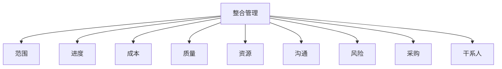

# 第 9 章 项目管理概论

> [!important] 本章定位
> 这是全科总纲。先记住：项目管理的核心是把目标、范围、进度、成本、质量、资源、沟通、风险、采购和干系人整合起来，持续交付价值。

> [!abstract] 零基础解释
> 项目管理就是带着团队，在限定时间和资源内完成一件有明确目标、但以前没有完全做过的事情。管理的重点不是“催大家干活”，而是持续协调目标、范围、进度、成本、质量和风险。

> [!example] 项目例子
> 建设校园报修系统是项目：有开始和结束，要交付一个独特系统；系统上线后的日常维修属于运营。项目经理要让需求、开发、测试、预算和用户验收互相配合。

## 1. 项目基础

项目是为创造独特的产品、服务或成果而进行的临时性工作。关键词：

- 临时性：有明确开始和结束，不代表成果短命。
- 独特性：成果、环境或交付方式具有独特之处。
- 渐进明细：随着信息增加，计划和成果逐步细化。
- 目标约束：范围、进度、成本、质量、资源、风险等相互影响。

运营是持续、重复、维持组织运行的工作；项目是有始有终的变革或建设工作。项目结束后产生的产品可能进入运营。

### 项目、项目集、项目组合

| 对象 | 关注点 |
| --- | --- |
| 项目 | 在约束下交付独特成果 |
| 项目集 | 管理相互关联的项目，获得单独管理无法获得的收益 |
| 项目组合 | 按战略目标选择、排序和管理项目及项目集 |
| 运营 | 持续稳定地提供产品或服务 |

## 2. 项目生命周期

生命周期描述从启动到结束的阶段和控制点。常见类型：预测型、迭代型、增量型、适应型和混合型。

- 预测型：范围较稳定，先规划后执行。
- 迭代型：反复完善解决方案或需求。
- 增量型：分批交付可用成果。
- 适应型：短周期、持续反馈、应对变化。
- 混合型：稳定部分预测，变化部分迭代或敏捷。

阶段门用于在阶段结束时评估成果、风险、资源和商业价值，决定继续、调整或终止。

## 3. 项目经理角色

项目经理负责整合资源和各方工作，推动目标实现。核心能力：技术项目管理、领导力、战略和商务管理。

主要职责：制定和维护计划、组织团队、管理干系人、处理冲突和风险、推动决策、监督绩效、管理变更、保证交付和收尾。

> [!warning] 易错
> 项目经理不是“所有工作亲自做”，而是建立机制、协调资源、做出或推动决策并对结果负责。

## 4. 项目管理过程组

过程组不是一次性顺序流程；项目中会反复迭代，监控结果可能触发重新规划和变更。

## 5. 十大知识领域

整合、范围、进度、成本、质量、资源、沟通、风险、采购、干系人。

记忆方式：

> 做什么（范围）→ 何时做（进度）→ 花多少（成本）→ 做得好不好（质量）→ 谁来做/用什么做（资源）→ 如何协作（沟通）→ 可能出什么问题（风险）→ 外部怎么获得（采购）→ 谁支持或反对（干系人）→ 如何把全部内容统起来（整合）。

## 6. 项目立项管理

### 可行性研究

从技术、经济、财务、运行、法律、组织实施、社会和风险等方面判断项目是否值得做、能不能做、怎样做。

### 评估与决策

评估对可研成果、方案、投资、效益、风险和实施条件进行审查比较，为立项决策提供依据。立项后形成授权和后续计划的基础。

## 7. 价值交付

项目成功不只看按时、按预算交付，还要看成果是否满足需求、产生预期收益、被用户采用并支持组织战略。项目管理要在交付物、结果和收益之间建立联系。

## 本章背诵清单

- [ ] 项目特征：临时性、独特性、渐进明细，并受范围、进度、成本、质量等约束。
- [ ] 项目有明确目标和期限；项目集管理相互关联的项目；项目组合按战略统一管理；运营是持续重复的日常工作。
- [ ] 五大过程组：启动、规划、执行、监控、收尾；十大知识领域长清单见 [[02-计算与专项/03-49个过程定义及作用]]。
- [ ] 项目经理能力：项目管理、战略与商务、领导力；职责是组织资源并对项目目标和交付结果负责。
