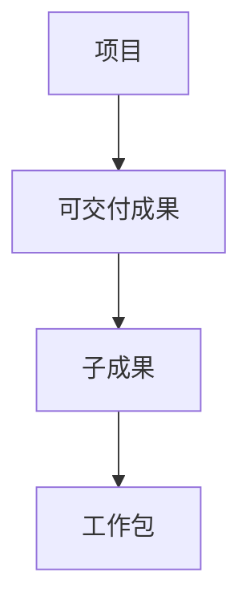
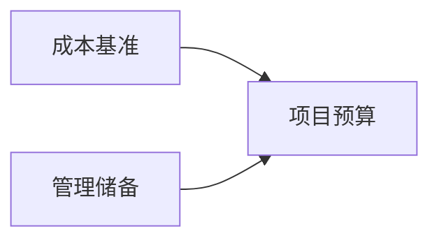

# 第 11 章 规划过程组

> [!important] 本章定位
> 规划过程组是基础知识和案例的核心。规划不是写完一次就不变，而是建立可执行的基准和控制方法，后续根据监控结果持续更新。

> [!abstract] 零基础解释
> 规划就是把“想做什么”变成“具体做哪些工作、什么时候做、花多少钱、谁来做、怎样判断做好了”。规划结果要形成基准，后面才能拿实际情况进行比较。

> [!example] 项目例子
> 报修系统不能只写“尽快上线”，而要拆成需求、设计、开发、测试和培训，估算每项时间和成本，明确验收标准，并提前安排风险应对。

## 1. 制定项目管理计划

> [!abstract] 白话解释
> 项目管理计划是项目的“总说明书”：规定怎么做、怎么检查、出现变化怎么处理、最后怎么收尾。它不是项目经理一个人写的，而是团队和关键干系人共同形成并批准。

整合各分项管理计划和基准，说明如何执行、监控、控制、变更和收尾。计划应由项目团队和关键干系人参与制定，并获得批准。

常见组成：范围、需求、进度、成本、质量、资源、沟通、风险、采购、干系人参与、变更、配置和发布等计划，以及范围/进度/成本基准。

## 2. 范围管理

> [!abstract] 白话解释
> 范围管理先确定“项目要做什么、不做什么”，再把要交付的内容拆成可安排、可估算、可验收的工作。边界不清，后面的进度和成本都没有可靠基础。

### 规划范围管理

> [!abstract] 白话解释
> 这一步不是定义具体功能，而是先规定以后如何收集需求、定义范围、验收成果和控制新增工作。

规定如何定义、确认和控制范围，输出范围管理计划和需求管理计划。

### 收集需求

> [!abstract] 白话解释
> 收集需求是把不同人的想法变成可记录、可确认的要求。不能只听一个人的意见，也不能把“希望”直接当成已经批准的范围。

通过访谈、问卷、观察、研讨会、焦点小组、原型、标杆对照等方法收集并记录需求，形成需求文件和需求跟踪矩阵。

### 定义范围

> [!abstract] 白话解释
> 定义范围就是把零散需求整理成一份清晰的“项目要交付什么”的说明，同时写清楚不负责什么，避免后面不断被动加工作。

把需求转化为详细范围说明书，明确产品范围、项目范围、主要可交付成果、验收标准和除外责任。

### 创建 WBS

> [!abstract] 白话解释
> WBS 是把项目成果像剥洋葱一样逐层拆开，直到拆成可以由一个人或一个小组估算、安排和验收的工作包。100% 原则表示所有项目工作都必须被覆盖。

以可交付成果为导向逐层分解，直到工作包。遵循 100% 原则，WBS 要覆盖全部项目范围；WBS 词典补充工作包的详细内容、责任、验收和约束。



## 3. 进度管理

> [!abstract] 白话解释
> 进度管理把工作排成一条可执行的时间路线：先拆活动，再确定先后关系，估算时间和资源，最后形成计划并持续控制。

### 规划进度管理

确定进度模型、活动属性、估算精度、单位、阈值、报告和更新规则。

### 定义活动与排列顺序

> [!abstract] 白话解释
> 工作包是成果层次，活动是执行层次。比如“完成登录模块”是工作包，设计页面、开发接口、编写测试可能是活动；排列顺序则说明哪些必须先完成。

把工作包拆成活动，明确活动属性、里程碑和依赖关系。依赖关系包括强制/选择性、内部/外部；逻辑关系常见 FS、SS、FF、SF。

### 估算活动持续时间

> [!abstract] 白话解释
> 活动持续时间是“做完需要多久”，不是投入多少人天。多人并行可能缩短日历时间，但也可能带来沟通成本，估算要说明依据和不确定性。

使用专家判断、类比、参数、三点估算、自下而上估算等方法，记录估算依据、假设和不确定性。

### 制定进度计划

> [!abstract] 白话解释
> 制定进度计划是把活动、依赖、时间、资源和约束放在一起，推导出每项工作什么时候开始和结束，并找出最不能拖延的关键路径。

综合活动、依赖、持续时间、资源、约束和风险，生成进度模型、关键路径、里程碑和进度基准。发生偏差时先分析，再通过调整资源、顺序、范围或变更进行纠偏。

### 网络图补充

箭线图法（AOA，也称双代号网络图）中，活动画在箭线上，节点表示事件；虚活动不消耗时间和资源，只用于表达逻辑关系。常见原则是：事件编号唯一、任意两项活动不能有完全相同的紧前和紧后节点、同一节点的流入或流出活动要符合逻辑关系。

### 资源优化

> [!abstract] 白话解释
> 资源平衡优先解决“资源不够或冲突”，可能让工期变长；资源平滑尽量在原定完工日期内调整。它们的直接目标都是解决资源安排，不是凭空创造更多人手。

- 资源平衡：根据资源供给限制调整活动安排，使资源需求与供给平衡，可能改变关键路径和项目工期。
- 资源平滑：在不突破资源可用量的前提下调整活动，通常不能改变关键路径和项目完工日期。
- 资源优化的目标是解决资源冲突，不是直接缩短工期。

## 4. 成本管理

> [!abstract] 白话解释
> 成本管理要先规定怎么算钱，再估算每项工作的成本，最后按时间汇总形成预算和成本基准。预算不是拍脑袋的总数，而是可以拿来比较实际花费的基线。

### 规划成本管理

明确估算、预算、控制、计量单位、精度、报告和阈值。

### 估算成本

估算工作包和活动所需的人员、设备、材料、服务、管理储备等成本，说明依据和置信度。

### 制定预算

将批准的成本估算按时间段汇总，形成成本基准；项目资金需求还要考虑管理储备和现金流。


### 应急储备与管理储备

> [!abstract] 白话解释
> 应急储备是为已经想到的风险留的钱，管理储备是为没想到但可能发生的未知情况留的钱。考试中最容易混淆的是：应急储备进入成本基准，管理储备通常不进入。

- 应急储备：应对已经识别的“已知风险”，属于成本基准的一部分，项目经理可按授权使用。
- 管理储备：应对未识别的“未知风险”，不属于成本基准，使用通常需要履行变更批准程序。



## 5. 质量管理

> [!abstract] 白话解释
> 质量管理不是最后找错，而是在制定标准、做事过程中就预防问题，并通过检查和改进保证成果符合要求。“做对过程”通常比“最后返工”成本低。

规划质量管理把相关方的质量要求转化为可测量的指标、标准、测量方法、责任人、检查频率和改进机制。质量要在过程中构建，不能只靠最后检查。

### 质量成本

质量成本（COQ）通常包括：

- 预防成本：培训、过程改进、质量规划和质量体系建设。
- 评估成本：检查、测量、审计和测试。
- 内部失败成本：产品交付前发现问题产生的返工、报废和重测成本。
- 外部失败成本：交付后由客户发现问题产生的保修、赔偿、投诉处理和信誉损失。

## 6. 资源管理

> [!abstract] 白话解释
> 资源包括人、设备、材料、场地等。资源管理要先说清谁负责什么、什么时候可用、需要什么技能，以及资源不足或冲突时如何处理。

### 规划资源管理

明确角色职责、组织结构、资源获取、培训、认可与奖励、团队建设、资源控制和释放。

可使用 RACI：负责（R）、批准/最终负责（A）、协商（C）、知会（I）。一个任务应避免多人“最终负责”或无人负责。

常见资源规划文件还包括：

- RBS（资源分解结构）：按资源类别和类型分层展示人员、材料、设备等资源。
- 资源日历：说明某类资源在什么时间可用、可用多久以及有哪些限制。
- 团队章程：约定团队价值观、沟通指南、决策过程、冲突处理、会议规则和团队共识。

### 估算活动资源

确定完成活动所需的人力、设备、材料和用品的数量、类型、技能和时间，输出资源需求、估算依据和资源分解结构。

## 7. 沟通管理

> [!abstract] 白话解释
> 沟通管理不是发消息越多越好，而是让正确的人在正确时间得到正确信息，并确认对方理解和采取了行动。信息过少会失控，过多也会淹没重点。

规划谁在什么时候需要什么信息、由谁提供、通过什么渠道、以什么格式、如何确认、如何升级和归档。沟通要与受众、紧急程度、敏感性和组织文化匹配。

沟通需求分析要确定干系人需要的信息类型、格式、详细程度、传递时机和信息价值。若项目有 `N` 个沟通参与者，潜在沟通渠道数为：

```text
N × (N - 1) / 2
```

## 8. 风险管理

> [!abstract] 白话解释
> 风险是尚未发生、但可能影响目标的不确定事件。风险管理不是预测一切，而是提前识别重要不确定性，评估影响，准备责任人和应对方案。

### 规划风险管理

确定风险管理方法、角色、预算、时间、概率影响定义、阈值、报告和跟踪方式。

### 识别风险

识别风险事件、原因、触发条件、可能影响和责任人，持续更新风险登记册。常用头脑风暴、访谈、SWOT、假设条件分析、清单和图解技术。

### 定性与定量分析

> [!abstract] 白话解释
> 定性分析先用高、中、低等方式排优先级，回答“先管谁”；定量分析再用概率和金额、工期等数字估算总体影响，回答“可能影响多少”。

- 定性：按概率、影响、紧迫性等排序，快速确定优先级。
- 定量：用 EMV、敏感性、决策树和蒙特卡洛模拟等量化总体风险和目标影响。蒙特卡洛通过概率分布和大量迭代，估算工期或成本达到目标的概率。

### 规划风险应对

为高优先级风险确定责任人、策略、具体行动、触发条件、应急方案和残余风险。

## 9. 采购管理

> [!abstract] 白话解释
> 采购管理是在决定“自己做还是外部买”后，选择供方、签合同、监督履约和处理争议。合同写得越含糊，后面越容易在范围、质量、付款和验收上扯皮。

规划自制/外购、采购类型、合同类型、采购工作说明书、供方选择标准、评标方法、付款和验收规则。

采购文件必须把范围、接口、质量、交付、服务、安全、知识产权、变更、违约和争议处理写清楚。

## 10. 干系人参与

> [!abstract] 白话解释
> 干系人参与不是把人通知一遍，而是根据对方的权力、利益和态度，设计沟通、协商和决策方式，让他们达到项目所需要的参与程度。

根据干系人的权力、利益、态度、影响和需求制定参与策略，明确沟通、协作、决策和升级方式，并在执行中持续调整。

## 本章背诵清单

- [ ] 范围基准=范围说明书+WBS+WBS词典。
- [ ] 进度五过程：规划进度管理、定义活动、排列活动顺序、估算活动持续时间、制定进度计划；成本三过程：规划成本管理、估算成本、制定预算。
- [ ] 资源平衡可能改变关键路径；资源平滑通常不改变关键路径；资源优化不能直接缩短工期。
- [ ] 应急储备应对已知风险并属于成本基准；管理储备应对未知风险且不属于成本基准。
- [ ] 质量成本：预防、评估、内部失败、外部失败。
- [ ] RBS=资源分解结构；资源日历=资源的可用时间和限制；团队章程=价值观、沟通、决策、冲突、会议和共识。
- [ ] 沟通渠道数=N(N-1)/2；蒙特卡洛通过概率分布和大量迭代估算风险结果。
- [ ] 100%原则：WBS覆盖全部项目工作，不多不少；关键路径=总持续时间最长的路径；三点估算公式见 [[02-计算与专项/01-计算专题]]。
- [ ] 定性风险分析=排序优先级；定量风险分析=用数值量化风险影响。
- [ ] 规划阶段各管理计划规定对应领域“如何管理”；完整过程清单见 [[02-计算与专项/03-49个过程定义及作用]]。
