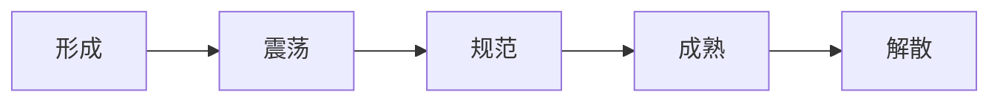

# 第 12 章 执行过程组

> [!abstract] 零基础解释
> 执行阶段就是按照已经批准的计划真正做事：组织人员和资源、开发产品、沟通信息、处理风险和采购，同时把过程中产生的新问题记录下来。

> [!example] 项目例子
> 报修系统进入开发阶段，项目经理安排程序员和测试人员，组织接口联调，召开例会，处理供应商延期，并把重要经验记录到项目知识库。

## 执行过程组做什么

> [!abstract] 白话解释
> 执行就是把批准的计划变成实际成果。项目经理一边组织工作，一边记录绩效、问题、风险和经验；执行中发现需要改变原计划的事情，要反馈给监控和变更流程。

执行过程组按照项目管理计划组织资源和工作，产生可交付成果，同时把新信息、问题、风险和变更反馈给监控过程。

## 1. 指导与管理项目工作

> [!abstract] 白话解释
> 这一步是项目的“主发动机”：按照计划安排工作、协调人员和供应商、解决执行障碍，并产出可交付成果。它不等于可以随意接受和实施未经批准的需求。

实施计划中的工作，管理技术、人员和供应商，产生可交付成果、工作绩效数据、问题日志、经验教训和变更请求。未经批准的变更不能直接实施。

## 2. 管理项目知识

> [!abstract] 白话解释
> 管理知识既要找到组织以前的经验来帮助当前项目，也要把当前项目的新经验留下来。文档是显性知识，个人经验和技巧是隐性知识，后者需要交流、辅导和复盘才能传递。

使用已有知识并创造新知识。显性知识可通过文档、模板、知识库共享；隐性知识要通过经验交流、辅导、复盘和协作传递。经验教训应在项目全周期持续记录，不要等到收尾才回忆。

## 3. 管理质量

> [!abstract] 白话解释
> 管理质量关注“做事的方法是否容易稳定地产出好结果”，所以重点是审计过程、找根因、改流程。控制质量才是对已经做出的成果进行检查和测试。

把质量管理计划和质量标准转化为可执行的过程活动，开展质量审计、过程分析、根因分析和持续改进，发现过程缺陷时提出改进和变更请求。

> [!warning] 管理质量 ≠ 控制质量
> 管理质量关注过程能力和改进；控制质量关注成果是否符合要求。

## 4. 获取资源

> [!abstract] 白话解释
> 获取资源就是把计划中的人、设备、材料、场地和服务真正落实下来。计划写了需要一个专家，不代表专家已经到位；拿不到资源时要及时暴露影响并调整。

依据资源管理计划获取团队成员、设备、材料、设施和服务。资源不足或供方不可用时，应分析影响、调整方案或提交变更，而不是默认资源一定存在。

## 5. 建设团队

> [!abstract] 白话解释
> 建设团队是让一群人从“各自完成任务”变成“能互相配合完成目标”。培训解决能力问题，规则解决协作问题，认可和奖励解决积极性问题。

通过培训、辅导、团队活动、认可与奖励、共同工作和沟通规则提升能力、凝聚力和绩效。

团队发展通常经历五个阶段，管理方式要随阶段变化：

1. 形成：成员刚加入，依赖明确目标、角色和规则。
2. 震荡：出现意见冲突和职责争议，需要沟通、协调和解决冲突。
3. 规范：形成共同规则和协作方式，团队稳定性提升。
4. 成熟：团队能够自我管理，高效完成工作。
5. 解散：项目或团队任务结束，完成交接、经验总结和人员释放。

## 6. 管理团队

> [!abstract] 白话解释
> 管理团队关注已经加入项目的成员表现和关系：给反馈、解决冲突、处理人员问题、调整分工。冲突本身不一定坏，回避问题才可能让冲突扩大。

跟踪个人和团队绩效，提供反馈，解决冲突，处理人员问题，维护团队关系并管理人员变动。冲突并非全部有害，关键是聚焦问题、事实和共同目标。

常见冲突处理：合作解决问题通常最彻底；妥协可快速达成暂时方案；回避、缓和和强制要结合情境使用。

## 7. 管理沟通

> [!abstract] 白话解释
> 管理沟通不只是把信息发出去，还要确认接收者看懂了、知道要做什么、结果是否反馈回来。状态报告要让决策者快速看懂现状、风险和需要的决定。

按沟通管理计划收集、生成、分发、存储、检索和处置项目消息。有效沟通必须考虑接收者是否理解、是否需要行动以及是否反馈确认。

状态报告应包括报告期间、总体状态、范围/进度/成本/质量、风险、问题、变更、预测、下一步和需要决策的事项。

## 8. 实施风险应对

> [!abstract] 白话解释
> 规划阶段写的是“准备怎么应对”，实施风险应对才是把这些动作真正做出来。例如风险是供应商延期，可能的应对是启用备用供方，而不是只在登记册里写一句“持续关注”。

执行风险登记册中已批准的应对措施，跟踪触发条件和效果，发现应对无效、出现残余风险或新风险时更新风险登记册并重新规划。

## 9. 实施采购

> [!abstract] 白话解释
> 实施采购是按采购规则选择供方并签订协议。评标不是只比报价，还要看对方能否按要求交付、质量是否可靠、风险是否可接受、服务和合规是否满足。

获取供方建议书或报价，组织投标人会议、建议书评价、谈判和供方选择，签订协议。评估不能只看价格，还要看技术、能力、质量、交付、风险、服务和合规。

## 10. 管理干系人参与

> [!abstract] 白话解释
> 这一步是把干系人分析结果转成实际行动：通过沟通、协商和问题解决，减少抵触、稳定期望、争取支持，并把重要承诺记录下来。

通过沟通、协商、谈判和问题解决调动干系人参与，处理期望和抵触，确保干系人理解目标、决策和影响。重要承诺要形成记录。

## 执行阶段通用控制点

- 做了什么要有可交付成果和绩效数据。
- 发生什么问题要进问题日志，不能只在群里说。
- 需要改什么要进变更流程。
- 得到什么经验要进经验教训登记册。
- 对外承诺要有责任人、时间和书面依据。

## 本章背诵清单

- [ ] 执行十过程：指导与管理项目工作、管理项目知识、管理质量、获取资源、建设团队、管理团队、管理沟通、实施风险应对、实施采购、管理干系人参与；完整作用见 [[02-计算与专项/03-49个过程定义及作用]]。
- [ ] 管理质量=改进过程；控制质量=检查成果。
- [ ] 团队发展五阶段：形成、震荡、规范、成熟、解散。
- [ ] 事件=已发生且先恢复服务；问题=查根因；风险=可能发生；变更=受控修改。
- [ ] 采购评标综合比较技术、质量、交付、服务、风险、合规和价格，不能只看最低价。
