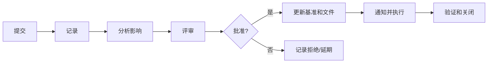
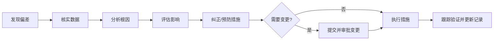

# 第 13 章 监控过程组

> [!important] 本章定位
> 监控不是“盯进度”，而是收集数据、与基准比较、分析偏差、预测结果、提出措施，并通过变更控制维持项目可控。

> [!abstract] 零基础解释
> 监控就是不断回答三个问题：现在做到哪里了？和原计划差多少？接下来怎么办？发现偏差后要先查原因、评估影响，再采取措施；涉及基准的修改必须经过变更控制。

> [!example] 项目例子
> 原计划本月底完成测试，但实际只完成一半。项目经理要核实数据，找出是需求变更多还是资源不足，评估对工期和成本的影响，再决定纠偏或提交变更。

## 1. 监控项目工作

> [!abstract] 白话解释
> 监控项目工作像给项目做体检：收集真实数据，与批准的基准比较，判断是否偏离目标，并预测最终结果。它看的是项目整体，不只是某一项任务。

从项目整体层面收集和分析绩效，比较范围、进度、成本、质量、资源、风险和干系人参与情况，形成工作绩效信息和报告，提出变更请求和预测。

常见输出：状态报告、进展报告、预测、变更请求、项目管理计划和项目文件更新。

## 2. 实施整体变更控制

> [!abstract] 白话解释
> 变更控制是项目的“总闸门”。任何会改变基准的请求都要先记录、分析影响、由有权限的人决定，批准后更新文件并通知执行，不能因为事情紧急就跳过记录。

变更影响至少评估范围、进度、成本、质量、资源、风险、采购、合同和收益。紧急变更也要有授权、记录和事后复盘。

> [!warning] 易错
> 监控发现偏差不等于可以直接修改基准；基准变更必须经过正式变更控制。

## 3. 确认范围

> [!abstract] 白话解释
> 确认范围是客户或授权相关方说“这个成果我接受了”。控制质量是团队证明成果符合技术要求，确认范围是相关方做正式验收，两个动作关注点不同。

由客户、发起人或授权相关方对已完成的可交付成果进行正式验收。输入包括核实的可交付成果和验收标准；输出包括验收的可交付成果、变更请求和项目文件更新。

### 与控制质量的区别

控制质量是项目团队检查成果是否符合技术和质量要求；确认范围是相关方对成果是否接受进行正式确认。通常先控制质量，再确认范围。

## 4. 控制范围

> [!abstract] 白话解释
> 控制范围是在项目进行中守住边界：计划内的工作要完成，计划外的新增要求要走变更。没有审批就不断加需求，叫范围蔓延。

监督范围状态，管理范围基准变更，防止范围蔓延。发现新增需求时，记录、分析和提交变更，而不是默默加入工作。

## 5. 控制进度

> [!abstract] 白话解释
> 控制进度不是简单催人，而是确认实际进展、找出拖延原因、判断会不会影响关键路径和最终日期，再选择调整资源、顺序或提交变更。

比较实际开始/完成、剩余工期和进度基准，分析关键路径、里程碑和趋势，采取纠正措施或提交变更。可使用趋势分析、关键路径法、挣值和假设情景分析。

## 6. 控制成本

> [!abstract] 白话解释
> 控制成本要看“已经花了多少”和“这些钱产生了多少完成量”，不能只看账户余额。挣值分析把进度和成本放在一起，帮助判断项目最后可能花多少钱。

监督实际成本和预算，使用挣值分析预测完工，管理资金和储备，分析偏差原因并提出纠偏或变更。

重点指标见 [[02-计算与专项/01-计算专题]]：`SV/CV/SPI/CPI/EAC/ETC/VAC/TCPI`。

## 7. 控制质量

> [!abstract] 白话解释
> 控制质量是对成果做检查、测试和测量，确认它是否符合标准并记录缺陷。发现问题后还要分析趋势和根因，避免同类问题反复出现。

通过检查、测试、核查表、抽样、控制图、缺陷审查和数据分析，确认可交付成果的正确性并记录缺陷。输出测量结果、核实成果、变更请求和质量文件更新。

## 8. 控制资源

> [!abstract] 白话解释
> 控制资源是在执行过程中确认人、设备、材料和场地真的按计划可用且没有浪费或冲突。资源问题如果不及时处理，往往会进一步变成进度和成本问题。

确保实物资源按计划获得、分配和使用，处理设备、材料、场地和供应不足、浪费、损坏和冲突，必要时更新资源需求和计划。

## 9. 监督沟通

> [!abstract] 白话解释
> 监督沟通是检查信息传递是否有效，而不是检查发了多少邮件。重点看信息是否及时、准确、完整，接收者是否理解，以及是否支持了决策和行动。

确认沟通是否及时、准确、完整、受众适配且产生了需要的效果。发现信息未到达、误解或渠道不合适时，调整沟通计划和方式。

## 10. 监督风险

> [!abstract] 白话解释
> 风险不是识别一次就结束。监督风险要看原风险是否变化、应对措施是否有效、有没有新风险或次生风险，以及风险储备是否还够用。

跟踪既有风险、识别新风险和次生风险、评估风险应对有效性、分析储备消耗并更新风险登记册。风险发生后转为问题处理，并保留事件和经验记录。

## 11. 控制采购

> [!abstract] 白话解释
> 控制采购就是按合同检查供方交付、质量、进度、付款和变更，出现违约或争议时依据合同处理，而不是只凭口头承诺管理供应商。

监督合同履行、交付、付款、质量、进度、变更、索赔和供方绩效，开展采购审计和绩效审查，按合同处理争议并维护采购文档。

## 12. 监督干系人参与

> [!abstract] 白话解释
> 干系人的态度会随项目变化。监督参与就是看他们现在支持、中立还是抵制，实际参与程度是否达到目标，然后调整沟通、协商和决策方式。

观察干系人关系、期望、态度和参与程度是否变化，调整策略、沟通和决策机制，使参与水平达到期望状态。

## 偏差处理模板

> [!abstract] 白话解释
> 偏差处理的顺序很重要：先确认事实，再找原因，再判断影响，之后采取措施；只有确实需要改变基准时才提交变更，最后还要验证措施是否有效并关闭记录。

## 本章背诵清单

- [ ] 监控十二过程的完整清单见 [[02-计算与专项/03-49个过程定义及作用]]。
- [ ] 确认范围=相关方正式验收；控制质量=检查技术和质量符合性；通常先控制质量，再确认范围。
- [ ] 偏差处理：核实数据→分析根因→评估影响→采取纠正/预防措施→必要时提交变更→执行→验证关闭。
- [ ] 变更必须记录、影响分析、授权审批、更新基准并通知执行，不能直接修改基准。
