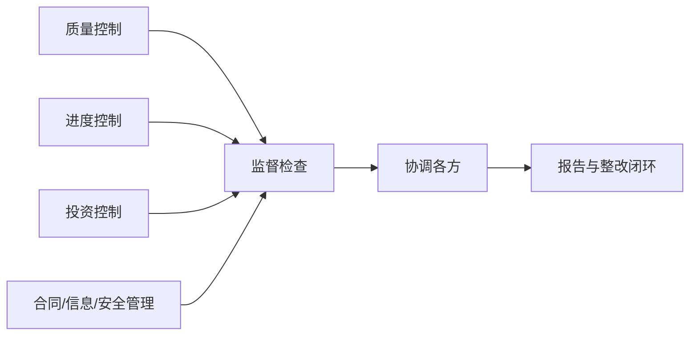

# 第 16 章 监理基础知识

> [!important] 本章定位
> 监理关注工程建设是否依法、合规、按合同和质量要求实施。要和项目经理职责区分：项目经理组织实施，监理相对独立地监督、检查、协调和报告。

## 1. 监理的意义

信息系统工程具有技术复杂、投资较大、参与方多、需求变化快和风险集中等特点。监理通过独立、专业的第三方服务，帮助建设单位控制质量、进度、投资和变更，协调合同关系并降低建设风险。

## 2. 监理相关角色

- 建设单位/业主：提出需求、提供条件、组织验收并支付费用。
- 承建单位/供方：负责设计、开发、集成、实施和交付。
- 监理单位：按合同和法规提供监督、检查、见证、协调和报告。
- 其他相关方：设计、设备厂商、运维、测评和审计机构等。

监理应保持独立、公正、诚信和保密，不代替承建单位承担实施责任，也不超越授权直接替业主做未经批准的重大决策。

## 3. 监理依据

- 国家法律法规和行业政策。
- 项目合同、招投标文件和补充协议。
- 经批准的项目建议书、可研、初步设计和实施方案。
- 需求、范围、质量、进度、投资和验收标准。
- 国家标准、行业标准、地方标准和组织制度。

## 4. 监理工作内容

### 三控制

- 质量控制：审查方案、见证测试、检查交付物、跟踪缺陷和验收。
- 进度控制：审查计划、跟踪里程碑、分析偏差、督促纠偏。
- 投资控制：审核预算、付款、变更和结算，控制投资偏差。

### 三管理

- 合同管理：监督合同履行、变更、索赔和争议。
- 信息管理：收集、审核、传递、归档和报告工程信息。
- 安全管理：监督施工、数据、网络、人员和运行安全要求。

### 一协调

协调建设、承建、供货、运维和其他相关方，推动问题解决并保留记录。

## 5. 监理工作过程

监理文件常包括监理规划、监理实施细则、监理日志、会议纪要、监理通知、质量/进度/投资报告、旁站或见证记录和验收意见。

## 6. 监理案例答题

遇到承建单位未按方案施工、质量问题反复、进度滞后：

1. 核对合同、批准方案和标准要求。
2. 记录事实、证据、影响和责任方。
3. 发出监理通知或整改要求，明确期限。
4. 复查整改结果，必要时组织测试或专家评审。
5. 对重大问题报告建设单位，按合同和制度升级处理。

## 本章背诵清单

- [ ] 监理原则：独立、公正、专业、保密。
- [ ] 三控制：质量、进度、投资；三管理：合同、信息、安全；一协调：协调项目相关方。
- [ ] 监理负责监督、协调和报告；项目经理负责组织实施并对项目结果负责。
- [ ] 问题闭环：证据记录→发出通知/要求整改→明确期限→复查→报告并归档。
