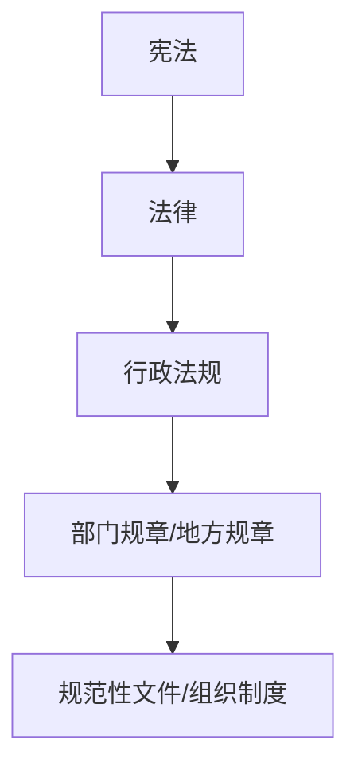

# 第 17 章 法律法规和标准规范

> [!warning] 使用说明
> 法律和标准会修订。本章只整理考试中需要的核心关系和关键词；具体条文、标准版本和地方政策以当年度官方公告、现行法律和考试大纲为准。

> [!abstract] 零基础解释
> 项目不是想怎么做就怎么做，还受到法律、标准、合同和组织制度约束。遇到冲突时，先判断规则的效力和适用范围，再按程序处理，不能只凭项目经理个人意见。

> [!example] 项目例子
> 系统要收集用户信息时，不能因为“开发方便”就随意收集和共享；应明确目的、控制权限、保护数据，并把法律和标准要求落实到需求、设计和验收中。

## 1. 法律效力层级

> [!abstract] 白话解释
> 法律效力层级是在解决“多个规则不一致时听谁的”。通常上位规则优先，但还要同时看适用范围、具体事项和文件是否仍然有效，不能只看文件名字。

一般理解为：宪法 → 法律 → 行政法规 → 部门规章/地方规章 → 规范性文件和组织制度。下位规则不能与上位法冲突；不同文件冲突时要看效力层级、适用范围和发布时间。

## 2. 项目常见法律

> [!abstract] 白话解释
> 项目中的法律问题通常不是要求你背完整法条，而是判断某件事涉及哪类约束：合同看双方承诺，招投标看采购程序，网络安全法看网络运行，数据安全法看数据处理，个人信息保护法看个人信息权益。

### 民法典合同编

> [!abstract] 白话解释
> 合同是项目各方对“交付什么、何时交付、多少钱、如何验收、违约怎么办”的共同承诺。项目出现争议时，先回到合同和补充协议找责任边界。

项目合同重点关注主体、标的、数量、质量、价款、履行期限、地点和方式、违约责任、争议解决、变更、解除和验收。电子数据在满足条件时也可能构成书面形式。

### 招标投标法与政府采购法

> [!abstract] 白话解释
> 这两类规则主要保证采购过程公平、透明、可监督。不能在评标后随意改变条件，也不能因为熟悉某家供应商就绕过公开程序和评审标准。

关注公开、公平、公正和诚实信用，依法进行招标、投标、评标、定标、合同签订和履行。政府采购还强调采购方式、预算、程序、监督和廉政要求。

### 网络安全法

> [!abstract] 白话解释
> 网络安全法更关注网络和网络运行本身是否安全，以及网络运营者承担什么责任。系统建设时要把安全要求放进设计、运营、监测和应急，而不是上线后再补。

关注网络运行安全、关键信息基础设施、网络信息保护、监测预警和应急处置。2025 年网络安全法已有修订，不能继续照搬旧资料的条文表述。

### 数据安全法

> [!abstract] 白话解释
> 数据安全法关注数据从产生、收集、存储、使用到共享、销毁的处理活动，以及不同数据的重要程度和保护责任。

关注数据处理活动、数据分类分级、风险监测、数据安全保护义务和数据开发利用之间的平衡。

### 个人信息保护法

> [!abstract] 白话解释
> 个人信息保护法关注“关于某个自然人的信息能不能收、为什么收、收多少、谁能用、保存多久、怎么保护”。业务方便不能成为无限收集和随意共享的理由。

处理个人信息应遵循合法、正当、必要和诚信原则，目的明确、范围最小、公开透明并采取安全保护措施；敏感个人信息需要更严格的保护。

### 电子签名法、著作权法和专利法

项目中要关注电子签名的法律效力、软件和文档的著作权、技术成果和专利权归属、许可使用、保密与知识产权侵权风险。

## 3. 网络与数据三法的区别

> [!abstract] 白话解释
> 三部法律可以这样区分：网络安全法看网络这条路和运营者，数据安全法看数据这种资源的处理和安全，个人信息保护法看个人信息主体的权益。一个项目可能同时受到三者约束。

| 法律 | 主要关注 |
| --- | --- |
| 网络安全法 | 网络和网络运行安全、网络运营者责任 |
| 数据安全法 | 数据处理活动安全、数据分类分级和国家数据安全 |
| 个人信息保护法 | 自然人个人信息权益和处理规则 |

三者不是相互替代的关系，项目应同时考虑网络、数据和个人信息保护要求。

## 4. 标准规范

> [!abstract] 白话解释
> 标准规范把“应该做到什么程度”具体化，例如接口格式、测试方法、安全要求和验收指标。项目引用标准时必须确认版本、适用范围和是否强制。

### 标准分类

> [!abstract] 白话解释
> 标准分类是在帮助你判断两件事：这个标准由谁发布、覆盖什么范围，以及它是必须执行还是推荐采用。推荐性标准一旦写进合同或验收依据，也不能在项目里随意忽略。

- 按层级：国家标准、行业标准、地方标准、团体标准、企业标准。
- 按性质：强制性标准和推荐性标准。
- 按内容：基础、方法、产品、服务、管理、测试和安全标准等。

强制性标准必须执行；推荐性标准在合同、招标文件或组织制度中被采用后，也可能成为项目执行依据。

### 项目使用标准的原则

1. 先确认适用范围、现行版本和强制属性。
2. 在合同、需求和验收标准中明确引用。
3. 把标准要求转成可验证的指标和测试项。
4. 变更标准或版本时走影响分析和变更控制。

## 5. 案例答题关键词

> [!abstract] 白话解释
> 法律法规案例的答题思路是“找依据、留证据、走程序、守边界”。不要只写“加强管理”，要说清依据是什么、谁负责、怎么整改、如何验证。

- 合同优先：按合同、招标文件和补充协议核对责任。
- 证据留痕：保存需求、通知、会议纪要、测试、验收和变更记录。
- 合规前置：在立项、设计、采购和上线前识别法律、安全和知识产权约束。
- 版本有效：不要默认网上旧标准仍然有效。

## 官方核对入口

- [国家网信办政策法规：网络安全、数据安全、个人信息保护等](https://www.cac.gov.cn/wxzw/zcfg/fl/A09370301index_1.htm)
- [工业和信息化部：数据安全法](https://www.miit.gov.cn/zwgk/zcwj/flfg/art/2022/art_284b390b84484f10b0e43eeafaad0f6d.html)
- [中国政府网：网络数据安全管理条例](https://app.www.gov.cn/govdata/gov/202409/30/520076/article.html)
- [最高人民法院公报：民法典](https://gongbao.court.gov.cn/Details/51eb6750b8361f79be8f90d09bc202.html)

## 本章背诵清单

- [ ] 效力层级：宪法→法律→行政法规→部门规章/地方规章→规范性文件或制度。
- [ ] 网络安全法管网络运行安全；数据安全法管数据处理和数据安全；个人信息保护法管个人信息权益和处理规则。
- [ ] 强制性标准必须执行；推荐性标准被合同、招标文件或项目制度采用后，成为项目执行依据。
- [ ] 法律、标准或验收要求变化：核对现行版本→分析影响→提交变更→批准后更新合同、计划和验收依据。
