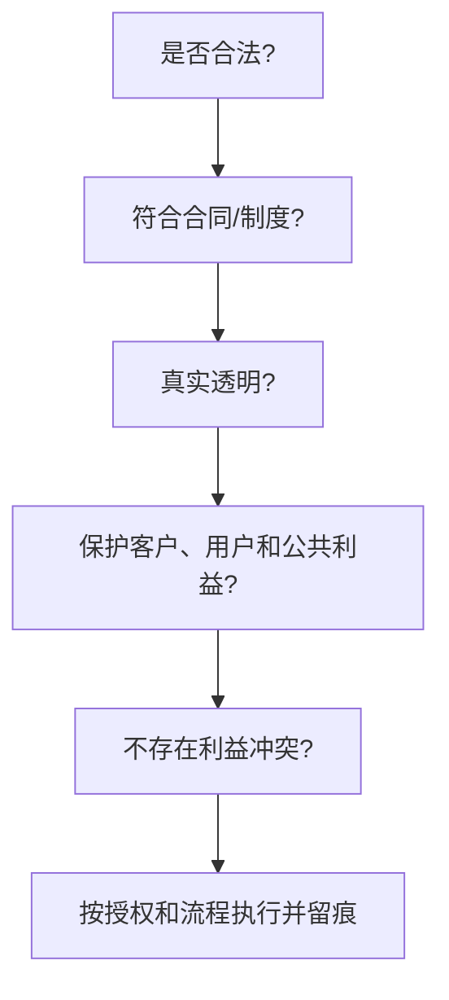

# 第 18 章 职业道德规范

> [!important] 本章定位
> 选择题通常考“哪个行为不符合职业道德”。判断原则很稳定：合法合规、诚实守信、客观公正、保密负责、避免利益冲突、保护客户和公共利益。

> [!abstract] 零基础解释
> 职业道德就是在没有人盯着时，仍然按事实、规则和责任做决定。项目经理不能为了让项目看起来顺利而隐瞒风险、伪造数据或牺牲安全和用户权益。

> [!example] 项目例子
> 供应商是项目经理亲属时，应主动披露并回避相关评标；测试发现严重安全问题时，即使会影响上线时间，也必须如实报告并推动处理。

## 1. 基本原则

> [!abstract] 白话解释
> 职业道德是在进度、成本或领导压力下仍然不造假、不隐瞒、不泄密、不偏袒，并且在能力或权限不够时主动说明和升级。

- 诚信：如实报告进度、成本、质量、风险和问题，不隐瞒或伪造数据。
- 责任：对自己的决策、交付物和管理行为负责，及时升级超出权限的问题。
- 尊重：尊重客户、同事、供应商和用户，公平对待团队成员。
- 公正：依据事实、标准和合同做判断，不因个人关系或利益偏袒。
- 保密：保护项目资料、商业秘密、个人信息和安全信息。
- 专业：持续学习，保持能力边界，不明知不能胜任仍作虚假承诺。
- 合规：遵守法律、标准、合同、组织制度和考试纪律。

## 2. 项目经理的职业责任

> [!abstract] 白话解释
> 项目经理的责任对象不只有项目老板，还包括客户、团队、用户和公众。做决定时要同时考虑交付结果、法律合规、信息安全和可能造成的社会影响。

### 对项目

> [!abstract] 白话解释
> 对项目负责，意味着真实掌握项目状态并及时处理偏差，而不是把坏消息藏起来让报表好看。问题越早暴露，越有机会纠偏。

建立合理计划和控制机制，及时报告偏差、风险和问题，不为了“好看”修改数据或压制真实情况。

### 对客户和组织

> [!abstract] 白话解释
> 对客户和组织负责，意味着说清楚承诺、边界和风险，保护合同、数据、资产和知识产权，不利用信息差诱导对方接受不必要或不合规的方案。

明确承诺和边界，保护客户利益和组织资产，管理合同、知识产权、数据和安全，不诱导客户采购与项目无关的产品。

### 对团队

> [!abstract] 白话解释
> 对团队负责，意味着分工和评价尽量公平，鼓励成员报告问题，不因为提出风险的人影响“进度形象”就压制他。

公平分工、合理评价、提供培训和反馈，营造安全沟通环境；对骚扰、歧视、欺诈和不当行为及时处理。

### 对社会和公众

> [!abstract] 白话解释
> 系统可能影响很多真实用户，所以不能为了赶工牺牲必要的安全、隐私、可靠性和无障碍要求。项目经理要考虑“上线后会影响谁”。

关注系统安全、用户权益、隐私、无障碍、可靠性和潜在社会影响，不为了进度牺牲必要的安全和合规要求。

## 3. 利益冲突

> [!abstract] 白话解释
> 利益冲突不一定已经造成违规，只要个人关系或利益可能影响判断，或者让外界合理怀疑判断不公，就应该披露并回避相关决策。

利益冲突是个人利益可能影响或看起来影响其专业判断。正确做法：

1. 识别并主动披露。
2. 避免参与相关评审、采购或决策，或接受正式授权和监督。
3. 保留记录，按组织制度处理。

> [!warning] 易错
> “没有实际收钱”不代表没有利益冲突；亲属、参股公司、礼品、回扣和私人关系都可能影响公正。

## 4. 面对压力时的判断顺序

> [!abstract] 白话解释
> 面对“先上线再说”“把缺陷改成通过”等压力，先问是否合法、是否符合合同和制度，再问是否真实透明、是否保护用户和公众，最后按授权流程执行并留痕。

如果上级要求隐瞒缺陷、伪造测试或绕过安全控制，应保留证据，明确风险，拒绝不当行为并按组织升级渠道报告。

## 本章背诵清单

- [ ] 职业原则：诚信、责任、公正、保密、专业、合规。
- [ ] 利益冲突：主动识别、披露、回避相关决策并留痕。
- [ ] 禁止隐瞒风险、伪造数据、收受不当利益、泄露项目和个人信息。
- [ ] 进度压力不能牺牲安全、质量、法律要求和用户权益。
