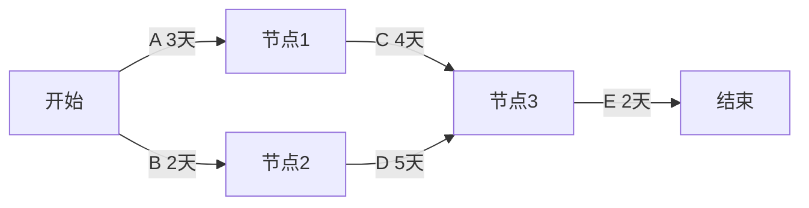

# 计算专题

> [!important] 计算题的统一做法
> 先写“已知量 → 公式 → 代入 → 结果 → 单位”。不要只写选项字母。

## 1. 三点估算与 PERT

### 公式

设最乐观时间为 `O`，最可能时间为 `M`，最悲观时间为 `P`：

```text
期望工期 Te = (O + 4M + P) / 6
标准差 σ = (P - O) / 6
方差 = σ²
```

### 概率

近似正态分布中，记住：

| 范围 | 概率 |
| --- | --- |
| 均值 ± 1σ | 68% |
| 均值 ± 2σ | 95% |
| 均值 ± 3σ | 99.7%（题目常简写为 99%） |

例如 `Te=21` 天、`σ=5` 天，26 天是 `Te+1σ`，则“26 天内完成”约为 `50%+68%/2=84%`；“26 天以后完成”约为 `16%`。

> [!warning] 易错
> “以内完成”和“以后完成”方向相反；先画均值和标准差，再判断面积。

## 2. 关键路径、七格图与浮动时间

### 关键路径

网络图中总持续时间最长的路径决定项目最短工期。总时差为 0 的活动通常在关键路径上；可能存在多条关键路径。

示意：如果从起点到终点有多条路径，分别计算每条路径的持续时间，最长的一条就是关键路径。



上图中路径 `A-C-E = 9天`，路径 `B-D-E = 9天`，因此存在两条关键路径。考试中不要凭图形长短判断，要按活动持续时间相加。

### 顺推和逆推

| 字段 | 含义 | 计算 |
| --- | --- | --- |
| ES | 最早开始 | 所有紧前活动 EF 的最大值 |
| EF | 最早完成 | `EF = ES + DU` |
| LF | 最晚完成 | 所有紧后活动 LS 的最小值 |
| LS | 最晚开始 | `LS = LF - DU` |
| TF | 总时差 | `TF = LS - ES = LF - EF` |
| FF | 自由时差 | 不影响紧后活动 ES 的可延迟时间 |

### 做题步骤

1. 标出起点和终点，补齐活动持续时间。
2. 从左向右顺推 ES、EF；有多个前置时取最大 EF。
3. 从右向左逆推 LF、LS；有多个后置时取最小 LS。
4. 计算 TF、FF；TF=0 的路径就是关键路径候选。

> [!warning] 易错
> 关键路径是“最长路径”，不是节点最多的路径；自由时差通常不等于总时差。

## 3. 挣值管理（EVM）

### 三个基础量

| 缩写 | 中文 | 解释 |
| --- | --- | --- |
| PV | 计划价值 | 截止时点按计划应该完成工作的预算 |
| EV | 挣值 | 截止时点实际完成工作对应的预算 |
| AC | 实际成本 | 截止时点实际花费 |
| BAC | 完工预算 | 全部项目计划预算 |

### 偏差和指数

```text
SV = EV - PV       进度偏差：SV<0 表示落后
CV = EV - AC       成本偏差：CV<0 表示超支
SPI = EV / PV      进度绩效指数：SPI<1 表示落后
CPI = EV / AC      成本绩效指数：CPI<1 表示超支
```

### 预测

```text
EAC = AC + (BAC - EV)                  原偏差一次性发生
EAC = AC + (BAC - EV) / CPI            当前成本效率继续
EAC = AC + (BAC - EV) / (CPI × SPI)    成本、进度共同影响
ETC = EAC - AC                         完工尚需估算
VAC = BAC - EAC                        完工偏差
TCPI = (BAC - EV) / (BAC - AC)         按原预算达标
TCPI = (BAC - EV) / (EAC - AC)         按新 EAC 达标
```

> [!important] 记忆
> `EV` 是完成了多少工作的预算价值，不是实际花费；`AC` 才是实际花费。

## 4. 沟通渠道

```text
n 个参与者的单向沟通渠道数 = n × (n - 1) / 2
```

新增一个参与者时，渠道会增加原人数条。

## 5. 风险概率、影响和 EMV

```text
EMV = 概率 × 影响
项目总 EMV = 所有风险 EMV 之和
```

- 威胁通常用负值；机会通常用正值。
- 概率—影响矩阵用于排序，不是替代定量分析。
- 决策树比较各方案的期望值，通常选择期望收益较大或期望成本较小的方案。

## 6. 合同类型与风险

| 类型 | 风险主要由谁承担 | 关键词 |
| --- | --- | --- |
| FFP 固定总价 | 卖方 | 范围明确、价格固定、卖方成本风险高 |
| FPIF 总价加激励 | 双方按机制分担 | 目标成本、目标利润、分享比例、最高价 |
| CPFF 成本加固定费用 | 买方 | 成本可报销，卖方费用固定 |
| CPIF 成本加激励费用 | 买方较多 | 成本、目标费用和分担比例 |
| T&M 工料合同 | 双方视条款而定 | 工时费率 + 材料费，适合范围不够明确 |

> [!warning] 易错
> 固定总价不是“任何变更都不能改价”；经批准的范围变更可以调整合同。

## 直接背公式

- [ ] PERT：`Te=(O+4M+P)/6`；标准差：`σ=(P-O)/6`；概率：1σ≈68%、2σ≈95%、3σ≈99.7%。
- [ ] 挣值：`SV=EV-PV`、`CV=EV-AC`、`SPI=EV/PV`、`CPI=EV/AC`；`SPI<1` 表示进度落后，`CPI<1` 表示成本超支。
- [ ] 七格图：顺推 `ES=max(前置EF)`、`EF=ES+DU`；逆推 `LF=min(后续LS)`、`LS=LF-DU`；总时差 `TF=LS-ES`；总时差为 0 的路径是关键路径。
- [ ] EMV：`概率×影响`；威胁通常记负值，机会通常记正值；其余长公式和例题见本页上文。
